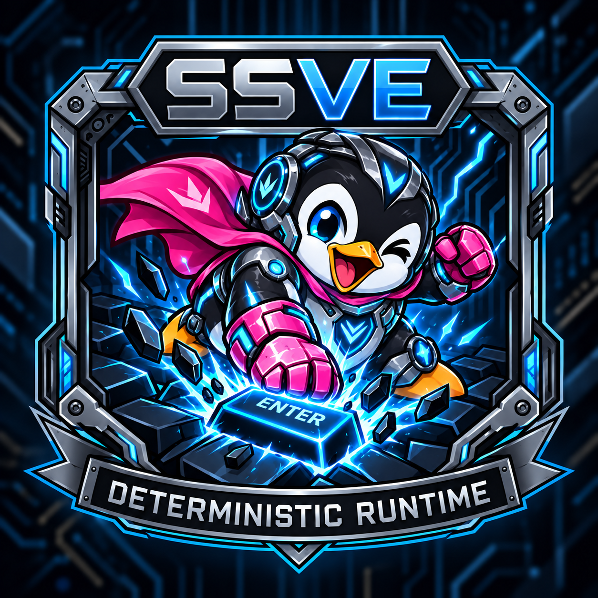
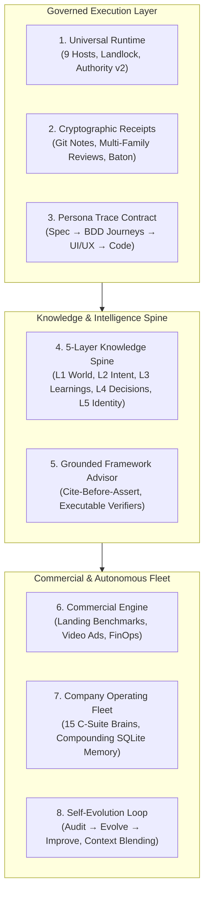

# Serious Serious Vibe Engineering (SSVE)

<p align="center">
  
</p>

> Vibe coding, but the vibe is governed engineering rigor.

**From a goal to a shipped product, a live business, and an autonomous
company. One pipeline. No improvisation.**

---

Most AI coding tools generate code. Some of them generate good code.
None of them ship a business.

SSVE is a deterministic development doctrine that starts where you actually
are — broke developer working evenings, funded founder with a team, or
anything in between — and walks a governed pipeline from raw intent to a
deployed product with landing pages, video ads, monetization architecture,
and an autonomous 15-brain executive fleet managing growth.

Every phase transition is cryptographically anchored in Git. Every agent
decision passes through a kernel-level enforcement engine. The system
doesn't improvise. It either delivers through progressive narrowing, or
rejects your idea with evidence and proposes alternatives.

## Why This Exists

Three pain points from years of vibe coding:

1. **Unpredictability.** Same prompt, different output every run. No
   deterministic path from intent to working code.
2. **No end-to-end pipeline.** Most frameworks stop at code generation.
   Nobody closes the loop from high-level intent through spec, design,
   implementation, testing, verified delivery, and commercial launch —
   let alone ships the landing page, the video ad, and the operating
   company behind it.
3. **No rejection path.** Agents always say yes and produce *something*.
   There is no honest "this won't work, here's what might" path with
   structured evidence and scored alternatives.

The idea: you give a high-level intent — a product idea or a feature within
an existing product — and the system either **delivers it** through
progressive narrowing, or **rejects it with evidence and proposes
alternatives** that you can accept or reject.

**It starts with you, not the product.** Before building anything, the
pipeline mines your builder profile — financial situation, time budget,
skills, team, social presence, existing subscriptions, business entity
status, and strategic goal. A broke developer working evenings gets
different recommendations than a funded founder with a marketer co-founder.
The profile persists across projects and gets smarter after each one.

**Don't know what to build? The pipeline finds it.** If your goal is
"I need money" but you don't have an idea, say so. The system reverse-
engineers what's making money RIGHT NOW, matches it to your skills and
distribution channels, and presents the top 3 opportunities — each with
evidence of existing revenue, a 1-2 week build plan, and a self-sustaining
free-tier stack. Target: $1K/mo within 1 month of launch. If you have a
big idea but need money first, the system proposes a staging plan — a
fast-money project (ideally feeding your big idea) before the main build.
"Build my idea anyway" always works.

**One prompt to product.** In `--autorun` mode, a single high-level intent
(or a selected opportunity) runs the full pipeline end-to-end. The virtual
founder (P0) makes taste decisions informed by your builder profile and
logs them for review. The only hard stops are: feature rejection (NO-SHIP),
unresolvable test failures, critical security findings, and merge
conflicts. Everything else flows.

**Designed for modern multi-agent economics** — provisions across 9 supported
agent CLI hosts, supporting worktree isolation, kernel-level Landlock sandboxing,
and a four-layer token cache that maximizes prompt cache hits.

### What actually happens when you run it

```
         YOU
          │
          ▼
   ┌──────────────┐
   │ Builder       │  Who are you? Financial situation, time budget,
   │ Profile       │  skills, team, distribution channels, goals.
   └──────┬───────┘  Persists. Gets smarter after each project.
          │
          ▼
   ┌──────────────┐
   │ Opportunity   │  Don't have an idea? The system finds what's
   │ Discovery     │  making money NOW, matches it to your profile,
   └──────┬───────┘  proposes 1-2 week builds. Target: $1K/mo.
          │
          ▼
   ┌──────────────┐  9 phases. 7 review gates. 105 skills.
   │ Progressive   │  Vision → Personas → Spec → UX → UI →
   │ Narrowing     │  Tech Design → Code → Promote → Verify.
   └──────┬───────┘  Each phase constrains the next. By Phase 7,
          │          the agent executes, not generates.
          ▼
   ┌──────────────┐
   │ Commercial    │  Landing page (≥7.5 quality gate), video ads
   │ Engine        │  (6-beat render pipeline), FinOps, monetization.
   └──────┬───────┘
          │
          ▼
   ┌──────────────┐  15 C-suite brains (COS, Legal, Finance,
   │ Company       │  Growth, Product, SecOps, RevOps, Comms...)
   │ Fleet         │  on SQLite FTS5 compounding memory ledgers.
   └──────┘
```

### What makes this different

| | Most AI tools | SSVE |
|---|---|---|
| **Starts from** | A ticket or prompt | Your identity, finances, and goals |
| **Ends at** | Generated code | Deployed product + business + operating company |
| **When it fails** | Silent hallucination | Structured rejection with evidence + alternatives |
| **Memory** | None | Builder profile + 5-layer knowledge spine + company memory ledgers |
| **Determinism** | "Run it again" | Cryptographic receipt chain + pipeline baton staleness detection |
| **Agent governance** | Trust the model | 10 lifecycle guards + PreTool AST engine + Landlock kernel sandbox |
| **Host lock-in** | One vendor | 9 hosts, zero-drift convergence, content-addressed installation |

### What's Built vs. What's Next

| Capability | Status |
|---|---|
| Builder profile mining | Built — financial, time, skills, team, social/distribution, tools, entity, goals, project history, failure patterns; updates after every project; persists globally |
| Find what to build | Built — reverse-engineers current market winners, matches to builder skills/distribution, 1-2 week builds on free-tier infra, staging strategy for big ideas, $1K/mo target within month 1 |
| Progressive narrowing (vision → verified merge) | Built — 9 delivery phases (16 pipeline stages), 7 review gates, 105 skills across 7 lanes |
| One prompt to product (`--autorun`) | Built — P0 decides at human checkpoints; only hard stops are NO-SHIP, test failure, security, merge conflict |
| Reject/pivot on infeasible intent | Built — 7 kill signals with evidence scoring; NO-SHIP produces structured rejection + alternative directions |
| Multi-host universal runtime | Built — content-addressed zero-drift convergence across 9 hosts: Claude Code, Kimi CLI, OpenAI Codex CLI, Google Gemini CLI, OpenCode CLI, Google Antigravity (AGY), MiMo-Code, Cursor Agent, and Grok Build CLI |
| Cryptographic chain receipts | Built — Git notes (`refs/notes/svc-receipts`) storing schema JSON receipts with SHA-256 baton integrity (coverage: strict-validate-if-present per WI-556); Pipeline Baton (`ac_digests`) navigation index |
| Durable mutation authority v2 | Built — repository-shared CAS leases with generation-locked transfer/resume; Linux Landlock kernel sandboxing (`scripts/svc-contained-exec.mjs`, runtime-probed on Linux hosts); PreTool typed decision engine |
| Persona Trace Contract | Built — strict persona ID traceability across specs, BDD journeys (`.feature.md`), UX, UI, tech designs, plans, and E2E assertions |
| Full commercial engine | Built — `landing-page` orchestrator (requires ≥7.5 weighted aggregate), `benchmark-landing` 10-dim rubric v2 gate (blocks <7), `ad-video-script` (6×~10s beat sheets) + `produce-ad-video` (modular I2V rendering, ducked audio), FinOps, and monetization audits |
| Company Operating Fleet | Built — 15 executive brains (`cos`, `counsel`, `fin-analyst`, `growth-lead`, `product-lead`, etc.) operating on-demand over SQLite FTS5 compounding memory ledgers (`company-memory.mjs`) |
| Domain expertise & Knowledge Spine | Built — 5-layer spine (L1 world, L2 intent, L3 learnings, L4 decisions, L5 identity); JIT topic recall (`recall-stack-knowledge`); `.sources.jsonl` provenance; auto-research gap loop |
| Grounded Framework Advisor | Built — `svc-advisor` backed by canonical `references/advisor/framework-knowledge-index.md`; cite-before-assert doctrine; executable verification commands |
| Self-evolution & context blending | Built — `audit-session-execution` → `evolve-framework` → `improve-framework` loop; SQLite candidate reservoir (WI-508); `blend-registry.json` tracking upstream frameworks |
| Pipeline decision log | Built — structured audit trail at `.svc/pipeline-decisions.jsonl`, with bootstrap files under `.svc/` and safe append helper `scripts/pipeline-log.mjs` |
| Worktree isolation per feature | Built — `worktree.sh` with guard, create, promote, cleanup |
| Subagent dispatch for parallel tasks | Built — transport scripts (`dispatch-worker.sh`, `fanout.sh`, `wait-for-output.sh`) across claude/openclaw/opencode harnesses |
| Autonomous scheduling & fleet cron | In progress — fleet brains run on-demand; weekly auto-scheduled orchestration driver queued |

## The Architectural Pillars of SSVE



### 1. Universal Multi-Host Runtime (9 Provisioned Hosts)
SSVE is host-agnostic. A single content-addressed command (`./setup --all-hosts`) provisions, wires, and verifies skills and lifecycle hooks across 9 major CLI platforms with zero drift:
- **Claude Code** (28 lifecycle hooks), **Kimi Code CLI** (13 hooks), **OpenAI Codex CLI** (6 hooks, consolidated PreToolUse launcher dispatcher), **Google Gemini CLI** (11 hooks, strict JSON stdout), **OpenCode CLI** (6 plugin events), **Google Antigravity (AGY)** (managed skills target & review station), **MiMo-Code** (6 plugin events via unified portable dispatcher), **Cursor Agent** (6 hook events, hooks.json), and **xAI Grok Build CLI** (8 hooks, TOML).
- Governed by **Durable Mutation Authority v2**: Generation-locked Git CAS controller leases, Linux Landlock kernel sandboxing (`scripts/svc-contained-exec.mjs`, runtime-probed for child tasks on Linux hosts with graceful fallback), and an authoritative PreToolUse decision engine separating instant read-only queries from guarded state mutations.

### 2. Cryptographic Chain Receipts & The Pipeline Baton
Every phase transition is anchored in cryptographic proof, not agent honesty:
- **Git Notes Receipts (`refs/notes/svc-receipts`):** Every plan, review, execution, and audit emits a schema-validated JSON receipt attached directly to commit objects in Git. Receipts survive branch deletions and are verified by the L3 `svc-reconcile` gate (strict-validate-if-present coverage per WI-556).
- **Multi-Family Adversarial Reviews:** Code is cross-examined by independent model families (Codex, Claude, AGY Gemini, Cursor Grok via `cursor-grok-4.6-high`) with signed identities via `scripts/run-external-review.mjs`.
- **Dual-Identity Bounded Reviews (WI-566):** Multi-model review orchestration is strictly capped at 3 rounds with HMAC-bound cycle tracking, preventing infinite review churn (distinct from the 5-step review gate convergence loop).
- **The Pipeline Baton (`ac_digests`):** A SHA-256 hash over normalized acceptance criteria signatures binds the plan to the spec as a staleness-bound navigation index. The live spec markdown remains authoritative; any mid-flight spec drift immediately detects mismatch and halts execution.

### 3. Persona Traceability & Living BDD Journeys
Software built without human grounding fails in production. SSVE enforces the **Persona Trace Contract**:
- Every spec story, BDD journey (`.feature.md`), UX interaction, design token, technical decision, and E2E test must trace explicitly to numbered persona IDs (`P1`, `P2`). Generic claims ("good for all users") fail validation.
- Live browser QA (`test-journeys`, `write-e2e`) executes real workflows against deployed URLs, capturing multi-breakpoint visual baselines (`track-visuals`) and proposing targeted layout refinements (`propose-ux-improvements`).

### 4. Domain Expertise & The 5-Layer Knowledge Spine
Agents often suffer from memory loss or build against outdated assumptions. SSVE solves this with the **Knowledge Spine** (`recall-stack-knowledge`, `analyze-domain`, `catalog-domain-capabilities`):
- **5-Layer Architecture:**
  - **L1 World Knowledge:** Reusable library (`references/knowledge/domains/`) structured into 3 progressive tiers: `INDEX.md` (<200 tokens), `CAPABILITIES.md` (~500 tokens), and `details/*.md` (deep extraction read on-demand). Governed by strict staleness tracking (`.version`) and source provenance checks (`.sources.jsonl`).
  - **L2 Project Intent:** Dynamic spec index (`.svc/spec-index.json`) mapping acceptance criteria and user stories.
  - **L3 Experiential (Learnings):** High-confidence heuristics in `learnings.jsonl` and `framework-learnings.jsonl`.
  - **L4 Episodic (Decisions):** Append-only architectural and vendor decision records (`.svc/pipeline-decisions.jsonl`).
  - **L5 Identity:** The builder's persistent profile (`~/.svc/builder-profile.md`) and project stack profile.
- **Just-in-Time Topic Recall:** Skills declare required topics in frontmatter (`requires_topics: [stack.iac-tool, domain.compliance]`, `recall_depth: layer-2`). The Spine gate injects only the exact matching slice.
- **Automated Gap-to-Research Loop:** When a skill encounters an unknown topic, it triggers an automated research loop that analyzes the domain, writes the knowledge node, and persists it into L1 World for all future projects.

### 5. Grounded Framework Advisor & Cite-Before-Assert Doctrine
When developers or agents need architectural guidance, `svc-advisor` provides answers strictly anchored in the canonical knowledge index (`references/advisor/framework-knowledge-index.md`):
- **Cite-Before-Assert:** Every material claim must cite an exact file path and section (`path § section`). Improvised opinions are rejected.
- **Verify Beats Memory Beats Stamps:** Critical facts (skill counts, gates, host wiring, hook event protocols) include executable shell verification commands that the advisor can run dynamically to guarantee ground-truth accuracy.
- **Atomic Restamping:** Whenever framework capabilities, lanes, or hosts change, the knowledge index is restamped in the exact same commit.

### 6. The Direct-to-Revenue Commercial Engine
SSVE does not stop at code generation—it ships the business:
- **Landing Page Generation (`landing-page`):** An end-to-end orchestrator fusing marketing context, sector reference banks, copy variants, and component scaffolding. Requires a ≥7.5 weighted aggregate score before handoff to `execute-changeset`.
- **Benchmark Landing Gate (`benchmark-landing`):** Captures multi-viewport rendering, motion, and visual delta against sector reference banks, scoring across 10 dimensions (rubric v2). Hard-blocks below a 7.0 score.
- **Direct-Response Video Ad Suite (`ad-video-script` + `produce-ad-video`):** `ad-video-script` writes modular DR scripts with render-ready 6×~10s beat sheets (per-beat image/motion prompts, character lock, last-frame seeding), which `produce-ad-video` renders with modular I2V stitching, ducked audio beds, and spectrogram QA.
- **Monetization Architecture & FinOps (`monetization-architecture`, `manage-finops`):** Automated cloud cost modeling, monthly recurring revenue staging, and code-level pricing tier audits.

### 7. The Company Operating Fleet
Scale beyond solo coding with 15 specialized executive operating brains operating on-demand over shared, compounding company memory:
- **Executive Roster:** `/cos` (Chief of Staff), `/counsel` (Legal & Compliance), `/fin-analyst` (Runway & Unit Economics), `/growth-lead` (Growth Loops), `/product-lead` (Roadmap & PMF), `/security-ops` (SecOps & SAST), `/revops` (Sales & CRM Design), `/comms` (PR & Brand Voice), and more.
- **Compounding Epistemic Memory:** The fleet operates on append-only ledgers (`decisions-pending.jsonl`, `decisions-log.jsonl`, `<role>/ledger.jsonl`) indexed by local SQLite with FTS5 search (`scripts/company-memory.mjs`). Decisions track real-world measured outcomes; successful heuristics compound into role playbooks after ≥3 outcomes.

### 8. Continuous Self-Evolution & Context Blending
The framework improves every time it is used:
- **The Empirical Self-Improvement Loop:** `audit-session-execution` inspects session logs and transcripts → `evolve-framework` identifies structural gaps → `improve-framework` implements and verifies fixes via automated replays.
- **Candidate Reservoir & Triage Engine (WI-508):** SQLite-backed feature intake engine scoring ideas via Chief of Staff weighted criteria before turning them into work items.
- **Context Blending Engine (`blend-external` / `blend-private`):** Systematically ingests best-of-breed industry patterns (Corey Haines marketing loops, GSD, superpowers, gstack) with automated redaction maps and upstream staleness tracking.
- **Retention Floors (`blind-control-plan`, `craft-prompt`):** Mathematical validation proving framework-governed output outperforms raw model prompts.

## The Lifecycle Hooks & Runtime Enforcement Engine

The true heartbeat of SSVE's reliability is its **pervasive multi-host hook system**. If you've ever watched an autonomous agent hallucinate progress, edit a lockfile to "fix" a dependency mismatch, bypass git safety checks with `--no-verify`, or enter an infinite loop trying the same broken command 20 times — this is the system that stops it cold.

Engineering this layer across nine completely disparate agent hosts was an enormous undertaking: every CLI vendor invented their own incompatible hook protocols, event lifecycles, and decision formats. SSVE unifies them into a single, deterministic, fail-closed enforcement engine.

### 1. Cross-Host Wire Parity: Taming Nine Incompatible Architectures

| Host CLI | Lifecycle Events | Hook Wiring Format | Decision Wire Protocol | Timeout Unit |
|---|---|---|---|---|
| **Claude Code** | 28 events | `~/.claude/settings.json` (JSON) | `hookSpecificOutput.permissionDecision` (async + asyncRewake) | Seconds (default 600s) |
| **Kimi Code CLI** | 13 events | `~/.kimi/config.toml` (TOML `[[hooks]]`) | `hookSpecificOutput.permissionDecision` | Seconds (default 30s) |
| **OpenAI Codex CLI** | 6 events | `~/.codex/hooks.json` + `config.toml` flag | Serialized `svc-enforce` launcher dispatcher | Seconds (default 600s) |
| **Google Gemini CLI** | 11 events | `~/.gemini/settings.json` (JSON) | Strict pure stdout JSON (`{decision: "deny"}`) | **Milliseconds** (default 60000ms) |
| **OpenCode CLI** | 6 events | `~/.config/opencode/plugins/` (TypeScript) | In-process module; throw Error to block | In-process |
| **Cursor Agent** | 6 events | `~/.cursor/hooks.json` (JSON) | Process exit code 2 to block | Exit-code bound |
| **xAI Grok Build CLI** | 8 events | `~/.grok/config.toml` (TOML `[[hooks.<Event>]]`) | `hookSpecificOutput.permissionDecision` | Seconds (default 30s) |
| **MiMo-Code** | 6 events | `~/.config/mimocode/mimocode.json` | Unified portable dispatcher plugin module | In-process |
| **Google Antigravity** | Skills target | Managed runtime | Canonical Google-family review station (`hooks: false`) | Managed |

- **Zero-Drift Transactional Installation:** `./setup --all-hosts` converges all 9 hosts atomically. If any host's symlinks or wire configurations drift, `scripts/check-install-drift.sh --all-hosts` flags it, and `hooks/svc-pre-commit-multi-host-check.sh` blocks git commits until parity is restored.
- **Strict Stdout Hygiene:** On hosts like Gemini CLI, even a single stray `console.log` on stdout causes the host parser to crash. SSVE enforces isolated stdout channels with clean JSON responses and redirectable diagnostic logs.

### 2. The PreTool Decision Engine (`hooks/lib/pretool-decision-engine.mjs`)

Instead of running a fragile chain of separate shell hooks, SSVE funnels all tool mutations through **one authoritative, typed PreTool decision engine**:
- **AST / Argv Lexing & Normalization:** Employs hardened lexers (`argv-lex.mjs`, `argv-encode.mjs`) that inspect actual command tokens rather than naive regexes.
- **Instant Read-Only Bypasses:** Safe observation commands (`git status`, `git diff`, `git grep`, `systemctl status`, `journalctl`) are classified instantly as side-effect free. They execute without requiring a work item, controller lease, or acquiring locks.
- **Automatic Git `--no-optional-locks` Injection:** Prevents read-only git queries from performing index refreshes that cause lock file contention across concurrent sessions.
- **Durable Mutation Authority v2:** Any mutating command requires a verified, repository-shared Git CAS controller lease (`renewControllerIfCurrent`) bound to an authorized worktree and active session generation. Foreign, unleased, or escaping mutations are denied before execution.

### 3. The Guard Arsenal

| Guard | Hook Lifecycle | Enforcement Action |
|---|---|---|
| **`pretool-decision-engine`** | `PreToolUse` | Single deny-capable gate verifying mutation authority, parsing argv, and dispatching sandboxed execution via `scripts/svc-contained-exec.mjs` |
| **`svc-workflow-guard`** | `PreToolUse` (Edit/Write/Bash) | **Hard block** on manual lockfile edits (`package-lock.json`, `Cargo.lock`), linter configs, or out-of-scope files; includes `--phase-boundary` mode blocking spec/plan edits during execution |
| **`svc-bash-guard`** | `PreToolUse` (Bash) | **Hard block** on `--no-verify` or `--no-gpg-sign` git bypasses; enforces orchestrator commit trailers |
| **`svc-loop-guard`** | `PreToolUse` / `PostToolUse` | Detects repetitive tool-call death spirals and halts runaway agent executions; cleans up owner-local session state |
| **`svc-eval-gate-pre / post`** | `Pre/PostToolUse` (`TaskUpdate`) | **Hard block** on completing tasks without filling the 8-pillar evaluation matrix (correctness, security, perf, UX, etc.) |
| **`svc-task-completion-guard`** | `Stop` | Anti-sloth gate: blocks agents from stopping when unfinished acceptance criteria or actionable tasks remain in the graph |
| **`svc-lane-tasks-validator`** | `PostToolUse` (Edit/Write) | **Hard block** on any syntax or state-transition malformation of the active `.svc/lane-tasks-*.json` task graph |
| **`svc-stop-quality`** | `Stop` | Automated batch formatter and type-checker running across every file modified during the session before yielding |
| **`svc-rule-injector`** | `SessionStart` / `PreToolUse` | Injects targeted domain rules, behavioral constraints, and project style contracts into context before tool execution |
| **`svc-session-contract`** | `SessionStart` | Binds active session identity to the work item and verifies controller lease boundaries |

## Origin Story

I'm a software engineer with 15 years of experience building and operating
distributed systems — infrastructure, DevOps, platform engineering, the
kind of work where unreliability isn't a UX annoyance, it's a production
incident at 3 AM.

That daily reality shaped my mission: **ship safer, production-ready
applications — not frontend wrappers.** The only way to get there is to
control the plan against its output at every stage — validation against
best practices, industry norms, multidimensional compliance, legal
constraints, security posture, cost modeling — all of it taken into
account before code hits a branch, not after.

That's the goal. The current focus is the foundation it all rests on:
**deterministic delivery that self-evolves** — a meta wrapper across
agent harnesses that governs execution, learns from every session, and
converges toward that goal one verifiable step at a time.

I had my own methodology — fully testable specs, every acceptance criterion
covered by E2E tests, progressive narrowing from vision to verified code. The
soul of the approach was already there.

Then I started using other people's incredible work:
[gstack](https://github.com/garrytan/gstack) (Garry Tan),
[superpowers](https://github.com/obra/superpowers) (Jesse Vincent),
[Oh My Claude Code](https://github.com/yeachan-heo/oh-my-claudecode) (Yeachan Heo),
and [claude-code-setup](https://github.com/petekp/claude-code-setup) (Pete Petrash).
Each one solved problems the others didn't. None of them combined into a single
streamlined flow.

So I built this — an opinionated blend of how I actually work. The best patterns
from each project, wired into one pipeline. The goal is that one day these
patterns can be ported back to help each project solve specific weaknesses,
while giving me (and anyone else who wants it) a single coherent experience
right now.

This framework is open source under the [MIT License](LICENSE). You can use it freely to build your own
products, services, and agentic workflows. Contributions and pull requests are welcome.

## The Problem

Large language models generate code through pattern matching. Given a spec,
an LLM produces different implementations on different runs — different
abstractions, different edge cases, different integration patterns. Each one
is confidently presented as correct. This is not a bug. It is how these
systems work.

Every methodology that goes from ticket to code, from spec to implementation,
from design to "let the agent figure it out" is accepting non-determinism as
a feature. Most of the time it works. Sometimes it doesn't. You find out in
QA, or in production, or when two agents implemented the same feature
differently in parallel branches.

SSVE rejects that.

## The Solution: Progressive Narrowing

Each phase constrains the space of possible outputs for the next phase. By the
time code is written, the implementation surface is tightly constrained — not by
pattern matching alone, but by the accumulated constraints from every prior phase.

```
Phase 1:  Vision              → infinite possibilities
Phase 2:  Personas            → narrows WHO
Phase 3:  Feature Spec        → narrows WHAT (stories, acceptance criteria)
Phase 4:  UX Design           → narrows HOW users experience it
Phase 5:  UI Design           → narrows HOW it looks
Phase 6:  Technical Design    → narrows HOW to build it
Phase 7:  Implementation      → narrows to ONE reviewed branch outcome
Phase 8:  Promotion           → squash-merges the worktree to main
Phase 9:  Verification        → proves the merge matches the manifest
```

At Phase 1, the agent is generating. By Phase 7, the agent is executing against
a constrained implementation plan inside a worktree branched from main. The
creative work happens in Phases 1-6 and in any explicit loop-backs. Phase 7 is
controlled execution with task reviews and checkpoints. Phase 8 is a squash
merge. Phase 9 is checking.

## Why This Works (Technical Argument)

An LLM's output variance is inversely proportional to the constraints in its
context window. More context = less variance. The progressive narrowing model
exploits this:

1. **Context loading.** Each phase reads ALL prior artifacts. The agent writing
   the change set has read the vision, personas, spec, UX design, UI design,
   technical design, journeys, and existing code. Every constraint is in context.

2. **Variance reduction.** A one-line ticket produces 50 implementations.
   A spec with 12 acceptance criteria produces 5. A detailed implementation
   manifest with explicit tasks, files, validations, and checkpoints reduces
   the remaining variance to a small, reviewable branch diff.

3. **Review before generation.** Traditional: agent generates code, human
   reviews code. SSVE: human reviews intent (spec, design, plan),
   then the agent executes that intent task by task on a branch. Reviewing
   intent early is cheaper than reviewing a fully improvised implementation late.

4. **Deterministic promotion.** The worktree IS the code. Promotion is
   `git merge --squash` to main. Deviations are detected by diffing the
   merged result against the manifest. Nothing is left to interpretation.

5. **Attention decay mitigation.** LLMs suffer from positional attention
   decay — tokens loaded early in context receive less attention during
   generation. Checkpoints (commits at each phase boundary) reset this by
   forcing the agent to re-read artifacts fresh. The worktree keeps all
   artifacts consistent and accessible as the agent's external memory.

## The Review Protocol

Every phase transition is gated by a structured review designed around LLM
failure modes:

```
Step 1: SELF-REVIEW      → agent reviews own work, produces structured findings
Step 2: SELF-JUDGMENT    → agent accepts/rejects own findings with reasoning
Step 3: CROSS-REVIEW     → second agent independently evaluates and hunts new findings
Step 4: CONVERGENCE      → medium/low only = PASS; critical/high = fix; 3 iterations = escalate
Step 5: GATE DECISION    → formal PASS / FAIL / ESCALATE block with state transition
```

This catches: agents missing own errors (Step 3), agents agreeing too easily
(Step 2 forces adversarial self-reasoning), review theater (severity classification
+ convergence criteria), and infinite loops (3-iteration gate loop cap, distinct
from WI-566 launcher's 3-round HMAC-bound review cap).

## Local-First, Mock-by-Default, Feature-Toggleable

The first iteration of anything you build with svc is demoable, stunning, and
runs locally with zero credentials. Every external dependency (payments, email,
storage, auth) ships with two implementations:

- **Mock** — ON by default. Works locally, returns realistic data, exercises
  the full acceptance criteria. This is what demos and E2E tests run against.
- **Real** — OFF by default. Behind a feature toggle. Enabled per-environment
  when ready (staging → production).

This is enforced at every phase: specs require mock strategies for all
integrations (G1), tech design defines the toggle architecture (G4), and
execution must pass a first-demo test locally with zero network access (G5).

Full convention: [`references/feature-toggles.md`](references/feature-toggles.md)

## The Pipeline

### Foundational Artifacts (created once, evolved)

| Artifact | Skill | Purpose |
|----------|-------|---------|
| Vision | `write-vision` | Product direction, boundaries, principles |
| Domain Profile | `analyze-domain` | Industry, tech stack, domain reference packs |
| Competitor Analysis | `analyze-competitors` | Comprehensive one-shot competitive deep-dive (new entrants) |
| Competitor Refresh | `refresh-competitors` | Weekly diff-based refresh of tracked competitor state |
| Capability Matrix | `catalog-domain-capabilities` | Classified industry capability catalog with gap analysis and build-priority scoring |
| Industry Grounding | `validate-feature` + `write-spec` | Default competitive grounding for every feature spec |
| Personas | `build-personas` | Who uses this (human and system consumers) |
| Design System | `design-ui` | Visual language: tokens, typography, colors, spacing |

### Builder Profile (created once, evolves)

| Artifact | Location | Purpose |
|----------|----------|---------|
| Builder Profile | `~/.svc/builder-profile.md` | Who is building: finances, time, skills, team, social presence, tools, entity, goals, project history, learned patterns. Persists across all projects and gets smarter after each one. |

### Per-Feature Pipeline

| Phase | Skill | Produces | Gate |
|-------|-------|----------|------|
| 3. Discovery | `validate-feature` | Feature Ship Brief or NO-SHIP rejection with evidence | Kill signal gate |
| 3. Spec | `write-spec` | User stories, ACs, system dependencies | G1 |
| 3b. AC Audit | `audit-ac` | Rewritten/added acceptance criteria | — |
| 3c. Journeys | `write-journeys` | BDD journey docs (.feature.md) with AC traceability | — |
| 4. UX Design | `design-ux` | Screen flows, states, interactions | G2 |
| 5. UI Design | `design-ui` | Component specs, design tokens, visual hierarchy | G3 |
| 5b. Visual Baseline | `track-visuals` | Breakpoint screenshots after UI design | — |
| 6. Technical Design | `design-tech` | Architecture, data model, feasibility | G4 |
| 6b. Alternatives | `explore-solutions` | Challenge baseline with alternative paradigms | — |
| 6c. Code Style | `define-code-style` | Code style contract for the project | — |
| 7. Plan | `plan-changeset` | Implementation manifest, task graph, AC/test mapping | — |
| 7b. Execute | `execute-changeset` | Code in worktree, staged diffs, checkpoint commits | G5 |
| 7c. Visual Diff | `track-visuals` | Screenshot diffs after UI-affecting code changes | — |
| 7d. Correctness | `audit-implementation` | Deep correctness audit before landing | — |
| 8. Promote | `land-changeset` | Squash merge to main, version bump, PR | G6 |
| 9. Verify | `verify-promotion` | VERIFIED status (spec-sync + QA + E2E proof) | G7 |

### Feature Spec Lifecycle

```
DRAFT → UX-REVIEWED → DESIGNED → BASELINED → CHANGE-SET-APPROVED → PROMOTED → VERIFIED
  ↓
REJECTED (NO-SHIP with evidence) → PIVOTED (alternative accepted) → DRAFT (re-enter pipeline)
```

## Feature Types

Every feature spec carries a type that identifies its consumer:

| Type | Consumer | Example |
|------|----------|---------|
| Feature | Human user | Match discovery, chat, payments |
| Enabler | Other service | Score recalculation cron, email service |
| Integration | External system | Stripe webhooks, OAuth provider |

All types go through the same pipeline. The type changes the consumer, not the
rigor. Specifying a Feature automatically reveals every Enabler and Integration
it depends on (the cascade effect).

## Workflow Lanes

SSVE routes work into lanes based on repo state and change type.
Use `route-workflow` to detect the right lane automatically, or pick one manually.

> [!NOTE]
> **Compiled-in Review Spine:** The macro lane sequences below reflect `laneDefinitions` in `skills-manifest.json`. During actual delivery execution, the runtime delivery graph (`skills/route-workflow/references/lane-model.md` and `task-graph.mjs`) automatically compiles in the mandatory review spine: `review-plan` runs immediately after `plan-changeset` before code execution, and `review-exec` runs immediately after `execute-changeset` before `review-gate` evaluation.

### Greenfield

Full progressive narrowing pipeline for new products or features in clean repos.

```
mine-builder → [find-opportunity] → [stage-revenue] →
write-vision → analyze-domain → analyze-competitors → catalog-domain-capabilities →
build-personas → validate-feature → write-spec → audit-ac → write-journeys →
design-ux → design-ui → design-logo → landing-page → track-visuals → design-tech →
explore-solutions → define-code-style → plan-changeset →
execute-changeset → track-visuals → benchmark-landing → review-gate →
audit-implementation → land-changeset → verify-promotion
```

`mine-builder` runs once (or quick-checks on return visits). `find-opportunity`
runs when the user doesn't have an idea. `stage-revenue` runs when the idea
is big but the builder needs money first. All three are skippable — "build
my idea anyway" jumps straight to `write-vision`.

Use when: starting a new project, adding a major feature to an empty or
near-empty repo, or the user says "build me an app" or "help me find what
to build."

### Brownfield Conversion

Onboard an existing repo into svc before applying other lanes.

```
onboard-repo → audit-coverage → sync-work-items
```

Use when: the repo has shipped code, docs, tests, or conventions that must be
inventoried and mapped before svc can govern it. Does not rewrite anything
— logs findings as work items and routes each to the right lane.

### Brownfield Feature

Extend an existing system with delta specs instead of regenerating the full world.
User-facing and admin-facing changes must carry UX/UI design and breakpoint
evidence. Only pure background enablers/integrations can skip them with an
explicit rationale.

```
sync-spec-code → validate-feature → write-spec → write-journeys →
design-ux → design-ui → design-logo → landing-page → track-visuals → design-tech →
explore-solutions → define-code-style → plan-changeset →
execute-changeset → track-visuals → benchmark-landing → review-gate →
audit-implementation → land-changeset → verify-promotion
```

Use when: adding a feature to a repo that already has specs, journeys, and
working code. Starts with drift check to ensure the spec baseline is accurate.

### Bugfix

Root-cause-first correction. Skips code style by default.

```
diagnose-bug → plan-changeset → execute-changeset →
review-gate → audit-implementation → land-changeset → verify-promotion
```

Use when: a work item describes broken behavior, a regression, or a production
issue. The diagnosis produces a brief with root cause, fix surface, and proof
plan before any code is touched.

### Drift / Maintenance

Reconcile specs, journeys, and code without shipping new behavior.

```
sync-spec-code → write-journeys → sync-work-items
```

Use when: specs have drifted from code (PLANNED items are now implemented,
code contradicts spec, journeys reference stale behavior). Produces updated
annotations and work items.

### Refactor

Preserve behavior while making bounded structural changes.

```
sync-spec-code → plan-changeset → execute-changeset →
review-gate → audit-implementation → land-changeset → verify-promotion
```

Use when: renaming, restructuring, extracting, or cleaning up code without
changing user-facing behavior.

### Framework Self-Improvement (Lane 7)

The closed-loop engineering lane for evolving and maintaining the SSVE framework itself.

```
test-framework → evolve-framework → blend-external → blend-private →
improve-framework → recall-stack-knowledge → plan-blast-radius →
track-topology-diff → refresh-competitors
```

Use when: improving the framework, integrating upstream external patterns, repairing regressions, or auditing runtime execution. `audit-session-execution` extracts real failure modes from transcripts and task logs, `evolve-framework` prioritizes gaps into actionable proposals, and `improve-framework` implements and replay-verifies fixes.


## The Worktree Model

All implementation phases happen in a single worktree branched from main.
Code lives in actual files, not markdown documents.

```
feature/match-discovery (worktree branch)
  src/...                  ← real code, real tests, real files
  docs/plans/manifest.md   ← what changed, why, task graph, validations
  checkpoint commits:
    phase-3-spec
    phase-4-ux-design
    phase-5-ui-design
    phase-6-technical-design
    task-1-types
    task-2-data-model
    task-3-tests
    ...
```

Each phase creates a checkpoint commit on the feature branch. The manifest
describes what changed, how tasks are grouped, and what validation should
happen, preserving reviewability. Promotion is `git merge --squash` to main —
one clean commit with the full context.

Full worktree model: [`WORKTREES.md`](WORKTREES.md)

## Token Efficiency

SSVE uses a four-layer cache architecture that reduces token costs by
50-60% compared to naive approaches:

| Layer | Scope | Cached across | Tokens |
|-------|-------|---------------|--------|
| 1. Project | Vision, personas, design system | All features, all tasks | ~15K |
| 2. Feature | Spec, UX, UI, tech design | All tasks of one feature | ~20K |
| 3. Code | Only files referenced by spec annotations | Parallel sub-agents | ~30K |
| 4. Task | Task instructions (unique) | Never cached | ~10K |

Key optimizations:
- **Phases 3-6 don't load source code.** The spec IS the codebase index
  (RESOLVED annotations with file:line). Code is loaded only in Phase 7.
- **Stable loading order** maximizes cache prefix matches across tasks.
- **Parallel sub-agents** share Layer 1-3 cache when dispatched together.
- **Phase-skipping** for non-UI features (Enablers skip Phases 4-5).

## Setup

### Platform

svc runs inside [Claude Code](https://docs.anthropic.com/en/docs/claude-code),
which executes bash commands, git operations, and file I/O through a Unix shell.
This means:

| Platform | Status | Notes |
|----------|--------|-------|
| **Linux** | Best | Native shell, fastest file I/O, no abstraction layers |
| **macOS** | Best | Native shell, fully supported |
| **Windows + WSL2** | Supported | Run inside WSL2 — not native Windows. Work in the Linux filesystem (`~/`), not `/mnt/c/` |
| **Windows native** | Not supported | Claude Code requires bash. cmd.exe and PowerShell don't work |

**If you're on Windows, use WSL2.** The entire svc pipeline — worktree
management, eval scripts, lint checks, skill execution — uses bash and assumes
a POSIX environment. WSL2 gives you a real Linux kernel with native ext4
performance. Working inside `/mnt/c/` (the Windows filesystem) is 3-5x slower
for git operations due to the 9P filesystem bridge — always keep your repo in
the Linux home directory.

### Prerequisites

| Requirement | Minimum | Recommended |
|-------------|---------|-------------|
| **Node.js** | 18+ | 20+ (LTS) |
| **Git** | 2.25+ | Latest |
| **Claude Code** | Latest | Latest |
| **GitHub CLI** (`gh`) | Optional | Install for `land-changeset` PR creation |
| **Anthropic account** | Required | Claude Pro ($20/mo) or Max ($200/mo for 100 instances) |

### Before Your First Product

The pipeline builds and deploys. You handle payments and posting.
Set these up once (15 min total) before running:

| What | Why | How |
|---|---|---|
| **Dodo Payments** | Accept payments with no company, handles VAT | [dodopayments.com](https://dodopayments.com) — sign up, verify identity |
| **GitHub account** | Code hosting + deployment triggers | You probably have this |
| **Vercel or similar** | Free hosting that scales | Connect GitHub repo, auto-deploys |

**MCP integrations** — the pipeline discovers and uses these automatically
if available. They replace manual steps:

| MCP | What it automates |
|---|---|
| Supabase MCP | Database creation, auth setup, storage |
| Stripe/Dodo MCP | Payment link creation, product setup |
| Vercel MCP | Deployment, environment variables, domains |
| Playwright MCP | Browser testing, QA, visual verification |
| GitHub MCP | PR creation, issue tracking |

The pipeline's `discover-skills` and `research` skills find available MCPs
at runtime. You don't need to install them all upfront — the pipeline will
tell you what it needs when it needs it.

### Install

```bash
# 1. Install Claude Code (if not already installed)
npm install -g @anthropic-ai/claude-code

# 2. Clone and install svc
git clone https://github.com/s7an-it/ssve.git ~/.claude/skills/svc
cd ~/.claude/skills/svc && ./setup

# 3. Verify — start Claude Code in any project
cd your-project && claude
```

The `setup` script symlinks all 105 skills + framework infrastructure
(DOCTRINE.md, REPO_MODES.md, scripts/, etc.) into `~/.claude/skills/`.
Symlinks mean `git pull && ./setup` updates everything in place.

`setup` also wires the svc enforcement hooks into `~/.claude/settings.json`
(global, applies to all projects). This includes the eval-gate hooks that
enforce pillar assessment at task completion. Restart Claude Code after
running setup to activate them.

**For Codex:** `./setup --host codex` installs to `~/.codex/skills/`, wires hooks into `~/.codex/hooks.json`, and enables `[features] hooks = true` in `~/.codex/config.toml`.

**For Kimi:** `./setup --host kimi` installs to `~/.kimi/skills/`. Kimi hooks are wired into `~/.kimi/config.toml`.

**For Gemini CLI:** `./setup --host gemini` installs to `~/.gemini/skills/` and wires hooks into `~/.gemini/settings.json`.

**For OpenCode:** `./setup --host opencode` installs to `~/.config/opencode/skills/`.

**For MiMo-Code:** `./setup --host mimo-code` installs to `~/.mimocode/skills/`.

**For Antigravity:** `./setup --host antigravity` installs to `~/.gemini/antigravity/skills/`. This is a skills-only target; hooks are not enforced until a verified Antigravity wirer exists.

**For Cursor:** `./setup --host cursor` installs to `~/.cursor/skills/` and wires hooks into `~/.cursor/hooks.json`.

**For Grok:** `./setup --host grok` installs to `~/.grok/skills/` and wires hooks into `~/.grok/config.toml`.

**For All Hosts:** `./setup --all-hosts` provisions all 9 supported hosts in parallel.

**Update:** `cd ~/.claude/skills/svc && git pull && ./setup`

### Optional: browser-based skills

`test-journeys`, `write-e2e`, and `track-visuals` need a browser for runtime
QA, E2E test authoring, and screenshot diffing. The primary integration is
[gstack](https://github.com/garrytan/gstack)'s browse daemon — if you have
gstack installed, `/browse` is available and auto-starts on first use.

Fallback chain if gstack browse is not available:
1. Playwright MCP (if configured) — functional but no persistence
2. Manual browser — the skill instructs you what to do

See [`references/browse-integration.md`](references/browse-integration.md)
for the full browser integration spec.

### Optional: live market research

[last30days](https://github.com/mvanhorn/last30days-skill) searches Reddit,
HN, X, YouTube, and Polymarket for real engagement signals from the past 30
days. When installed, `validate-feature` and `analyze-competitors` use it
to ground business questions in live data instead of LLM training data.

```bash
git clone https://github.com/mvanhorn/last30days-skill.git ~/.claude/skills/last30days
```

Zero-config start: Reddit, HN, and Polymarket work with no API keys.

### Optional: voice mode on WSL2

Claude Code supports voice input. On WSL2, audio requires PulseAudio or
PipeWire bridging between Windows and the Linux kernel — it doesn't work
out of the box. Run `/wsl2-audio` to diagnose and fix the full audio chain
(Application → ALSA → PulseAudio → WSLg → Windows speakers/mic).
This covers both Claude Code voice mode and general audio in WSL2.

## Repository Modes

- **bootstrap** — greenfield, no established workflow. SSVE creates the
  structure from scratch.
- **convert** — brownfield, existing code and conventions. SSVE inventories
  first, adapts second.

Mode contract and detection logic: [`REPO_MODES.md`](REPO_MODES.md)

## Included Skills

<!-- svc:generated:begin readme-included-skills — edit skills-manifest.json / references/model-registry.json, then run: node scripts/generate-manifest-mirrors.mjs --write -->
- `ad-video-script` — Performance ad-video script writer (Senior DR Creative Strategist). Reads the real product first, then emits a placement-aware modular script + render-ready 6×10s beat sheet (per-beat image+motion prompts, character lock, last-frame seeding). One base or many variants; hands the beat sheet to `produce-ad-video`.
- `align-feature` — Execute the story-receipts chain for one WI until STORY ALIGNED — the fixing counterpart of audit-feature
- `analyze-competitors` — Comprehensive one-shot competitive deep-dive for new entrants
- `analyze-domain` — Build domain expertise and reference packs
- `analyze-marketing` — Mine feature specs for marketing angles
- `assess-market-readiness` — Multi-role readiness judge scoring whether the product is ready for launch, hackathon, VC pitch, or PMF
- `audit-ac` — Audit and rewrite acceptance criteria for completeness
- `audit-coverage` — Audit a project against the full svc canonical artifact catalog (CANONICAL/FOREIGN/MISSING classification with consolidation recommendations)
- `audit-feature` — Full drift audit for one feature or journey — branch-index census plus independent verification, seeding the story-receipts chain
- `audit-implementation` — Deep correctness audit before landing
- `audit-session-execution` — Reconstruct a real run from WI/task graph/logs/transcript and compare expected vs actual execution to produce framework-grade gap evidence
- `base44-environment` — Operate the Example Marketplace Base44 backend environment: API calls, secrets checks, schema/function deployment, and integration debugging
- `benchmark-landing` — Score a landing page against sector reference bank on 8 dimensions
- `blend-external` — Analyze external repos and blend in useful patterns with version tracking
- `blend-private` — Blend patterns from a private repo you own or have rights to, without leaving source identifiers in the tree (authorization gate + redaction map + 30% diff ceiling)
- `blind-control-plan` — Best-of-2 retention floor: prove the framework plan is never worse than a bare-model blind baseline (cross-family judge + control-plan ROI receipt; WARN/shadow, default OFF)
- `build-personas` — Build user personas from vision and challenge libraries
- `capability-concierge` — Three-lens recommendations (ship / idle-resource / side-earning) grounded in registry + snapshot
- `capability-registry` — Per-builder inventory of AI/dev resources (paid + trial + free) with sub-budgets and reset cadence
- `capture-idea` — Zero-friction backlog intake: stores a raw idea as a canonical WI without triggering validation or spec authoring
- `catalog-domain-capabilities` — Classified industry capability catalog with gap analysis and build-priority scoring
- `comms` — Draft-only company communications proposals; never sends or publishes.
- `cos` — Chief-of-staff synthesis for company briefings and ranked priorities.
- `counsel` — Legal issue spotting and reviewable risk proposals; not legal advice.
- `craft-prompt` — Craft a world-class output-shaped prompt for a task and prove it never worse than a baseline/viral prompt via a cheap best-of-2 floor (rubric + WI-410 floor; WARN/shadow, default OFF)
- `create-skill` — Create new skills with eval infrastructure (forked from anthropics/skills)
- `customer-cs` — Customer-success analysis for churn, onboarding, and support patterns.
- `decide` — Present a decision to the founder so it can actually be decided — one choice at a time, options as outcomes, grounded confidence per option
- `define-code-style` — Define or audit the project code style contract
- `design-logo` — Produce an iterative SVG logo/lockup pack with rubric-gated refinement and live in-app evidence
- `design-tech` — Define architecture, data model, feasibility matrix
- `design-ui` — Define component specs, design tokens, visual hierarchy
- `design-ux` — Define screen flows, state machines, interaction patterns
- `diagnose-bug` — Root-cause investigation before any fix
- `discover-skills` — Find and install external skills
- `discuss-phase` — Resolve bounded gray areas into a durable discussion artifact with next-step routing
- `dispatch-waves` — Plan conflict-aware parallel WI waves, select worker transport, and validate merge-back evidence
- `evaluate-rule` — Decide whether a candidate rule (CLAUDE.md/AGENTS.md injection) beats Claude's default behaviour via a bias-isolated 2-pass probe, with optional cross-model challenge for global-scope rules. Prevents rule inflation.
- `evolve-framework` — Find improvement opportunities in the pipeline with grounded evidence
- `execute-changeset` — Execute the plan in a worktree with TDD and checkpoints
- `explore-solutions` — Challenge the chosen approach with alternative paradigms
- `explore-ux` — Interactive competitive UX exploration on live app surfaces. Browses, benchmarks against competitor knowledge, proposes improvements with citations
- `extract-bootstrap` — Extract patterns from a codebase into templates
- `fin-analyst` — Evidence-backed runway, unit-economics, and budget analysis.
- `find-opportunity` — Reverse-engineer market winners, match to builder, score top 3
- `generate-visuals` — Image/visual asset router. Takes one asset brief and routes it across image-gen providers (Codex CLI, Gemini Nano-Banana Pro / Imagen 4, Stitch MCP, Figma+Weave MCP, Claude Design, gpt-image-2 (with gpt-image-1.5 fallback), Storyset, Veo 3). License-gated; provenance log per candidate set.
- `growth-eng` — Growth instrumentation and measurement proposals; never deploys.
- `growth-lead` — Growth strategy proposals for acquisition, activation, and retention.
- `honest-diagnosis` — Evidence-graded "why haven't I shipped" answer with file/line citations; no platitudes
- `improve-framework` — Self-improvement loop: evidence → diagnosis → fix → verify → record
- `infra-sre` — Reliability, incident-readiness, SLO, and capacity review.
- `ingest-guide` — Paste long-form social content; extract, validate claims via experiments, route to discard / reference knowledge / new skill
- `ingest-guide-batch` — Parallel candidate orchestrator — fan out N pasted guides into isolated worktree sessions, aggregate decisions into one digest
- `land-changeset` — Validate, version, PR, squash-merge, clean up
- `landing-page` — End-to-end landing-page generation orchestrator. Chains marketing-context + reference-bank + copywriting + generate-visuals + component scaffold + benchmark-landing gate. Blocks below 7.5 weighted. Slots between `design-ui` and `execute-changeset` for any landing/marketing/home/pricing/feature page.
- `launch-knowledge` — Universal launch knowledge base for software founders (legal vehicles by jurisdiction, startup credit programs, hosting/platform bundles, first-100-customer distribution playbooks) layered with a thin per-builder profile that accretes over time
- `list-work-items` — Show the local svc backlog ordered by dependency and priority
- `manage-finops` — FinOps expert for cloud infrastructure selection, cost optimization, solo-developer launch planning, and MMR (Monthly Recurring Revenue) strategy
- `manage-learnings` — Review, search, prune, export project learnings
- `market-intel` — Market, competitor, trend, and positioning evidence synthesis.
- `mine-builder` — Mine builder profile (finances, skills, social, tools, project history, patterns)
- `monetization-architecture` — Map features to pricing tiers with evidence-graded justification, select gating mechanisms, and audit code enforcement against stated pricing policy
- `onboard-repo` — Inventory and map a brownfield repo
- `plan-blast-radius` — SEV-tier classifier for infra plan changes (SEV-1/2 forces human checkpoint). Phase 8 of infra-* lanes. From WI-SPINE-004.
- `plan-capabilities` — Classify project type, recommend MCPs/skills/research, maintenance plan
- `plan-changeset` — Produce implementation manifest with task graph
- `platform-operating-architect` — Classify platform operating model, split local/dev/staging/prod, define integration boundaries, and encode how svc should coexist with hosted platforms
- `privacy-dpo` — Privacy, personal-data, DPIA, and retention review.
- `procurement` — Vendor diligence and buying-decision proposals; never purchases.
- `produce-ad-video` — Render and finish ad/launch video from a beat sheet or locked picture: I2V stitch, one ducked music bed, listen/spectrogram QA, `~/delivery` masters. Complements `ad-video-script`.
- `product-lead` — Product prioritization, problem validation, and roadmap tradeoffs.
- `quick-fix` — Compatibility-only retired lane; new work uses the full mandatory chain
- `recall-stack-knowledge` — Knowledge Spine recall gate (see WI-SPINE-001)
- `refresh-competitors` — Weekly diff-based refresh of tracked competitor state
- `research` — Resolve uncertainty about APIs, libraries, patterns
- `reverse-engineer` — Deconstruct any company/product/tweet/technique, produce teardown + build brief with unique twist
- `review-cross-model` — Adversarial review via a second model
- `review-exec` — G5-enforcing gate: self-review + adversarial review of executed diff before land (mandatory-chain plan)
- `review-gate` — Run the 5-step adversarial review at gates G1-G7
- `review-plan` — Plan-level adversarial review gate between plan-changeset and execute-changeset
- `review-security` — OWASP Top 10 + STRIDE + supply chain audit
- `revops` — Revenue-funnel, pipeline-process, and lead-handoff proposals.
- `roadmap-evaluation` — Synthesize project artifacts into prioritized milestones with cost estimates and timeline to first paying customer
- `route-workflow` — Detect lane and route to the next skill
- `security-ops` — Security risk, threat-model, incident-control, and control review.
- `stage-revenue` — Break big ideas into revenue stages (fast money first, then the real thing)
- `strategic-decision` — N-way strategic decisions spanning multiple features, vendors, or years (vendor selection, build-vs-buy, framework/database/hosting/AI-model selection, pricing-model selection, strategic pivot)
- `suno-architect` — Convert Suno song, album, and lyric briefs into copy-paste-ready generation recipes with structured style, lyrics, and phonetic guidance
- `svc-advisor` — Q&A grounded in stored framework knowledge (svc capabilities, gaps, competitor comparisons)
- `sync-spec-code` — Reconcile spec annotations against codebase
- `sync-work-items` — Push repo-canonical work items to GitHub Issues
- `tax-auditor` — Tax evidence and filing-readiness review; not tax advice or filing.
- `teach-project` — Teach the builder what was built and how to manage it (owner guide)
- `test-framework` — Benchmark the svc pipeline itself
- `test-journeys` — Journey-first QA against a live URL
- `track-topology-diff` — Post-apply structural state-graph snapshot + diff (replaces track-visuals for infra lanes)
- `track-visuals` — Capture and diff screenshots across breakpoints
- `validate-feature` — Validate a feature idea with relevant business evidence, consequential decisions and a kill signal
- `verify-promotion` — Post-merge verification (spec-sync + QA + E2E)
- `write-e2e` — Write E2E test files from journey docs
- `write-journeys` — Generate BDD journey docs with AC traceability
- `write-spec` — Write feature spec with user stories and ACs
- `write-vision` — Create or refine the product vision
- `wsl2-audio` — Set up, diagnose, and fix audio/voice mode on WSL2
- `propose-ux-improvements` — Assess a named UI region or redundant control using current spec, code and rendered evidence
<!-- svc:generated:end readme-included-skills -->

Framework lane rule of thumb:
`audit-session-execution` turns a messy real session into expected-vs-actual evidence.
`evolve-framework` finds and prioritizes the gaps.
`improve-framework` is for cases where findings/proposals already exist and you want to validate, implement, and replay-verify fixes.

## Full Doctrine

The complete methodology — technical argument for progressive narrowing,
review protocol specification, worktree model, promotion process, token cost
analysis, and execution model:

[`DOCTRINE.md`](DOCTRINE.md)

## Skill Pack Comparison

How svc compares to gstack and superpowers:

[`references/skill-pack-comparison.md`](references/skill-pack-comparison.md)

### Feature Comparison Matrix

| Capability | Bare LLM / CLI | GSD / Superpowers | gstack | **SSVE** |
|---|---|---|---|---|
| **Supported Hosts** | Single Host | 1–2 Hosts | Single Host | **9 Hosts Converged (Claude, Kimi, Codex, Gemini, OpenCode, AGY, MiMo, Cursor, Grok)** |
| **Execution Governance** | None | Ad-hoc TDD | None | **Durable Authority v2 + Landlock Kernel Sandboxing** |
| **Review Integrity** | Self-Prompted | 2-Stage Review | Adversarial Review | **Multi-Family Signed Reviews (Codex/Claude/Gemini/Grok) + Dual-Identity Bounded Caps** |
| **Audit Verification** | None | Markdown Logs | None | **Cryptographic Git Notes (`refs/notes/svc-receipts`) + Zero-Waiver L3 Reconcile** |
| **Pipeline State Handoff** | Context Resend | Linear Scratchpad | None | **Pipeline Baton (`ac_digests`) with SHA-256 Normalized AC Staleness Binding** |
| **User Grounding** | Vibes | Ad-hoc Personas | Founder P0 | **Persona Trace Contract (Strict spec → journey → UX → UI → code → E2E trace)** |
| **Domain & Industry Knowledge** | Training Cutoff / Hallucinations | Ad-hoc Notes | Basic Founder Advice | **5-Layer Knowledge Spine (L1–L5) with JIT topic recall, provenance checks, and persistent cross-project library** |
| **Framework Advisor & Meta-Q&A** | Improvised Hallucination | None | Static Persona | **`svc-advisor` with Cite-before-assert doctrine & executable verification commands** |
| **Commercialization** | Code Only | Code Only | Basic Design Review | **Full Commercial Engine (Landing Page Orchestrator + 8-Dim Benchmark Gate + Video Ad Suite)** |
| **Autonomous Operations** | None | None | None | **15-Brain Company Fleet with SQLite FTS5 Compounding Memory & Outcome Feedback** |
| **Self-Improvement** | None | Manual Rules | None | **Closed-Loop Self-Evolution (`audit` → `evolve` → `improve` + Candidate Reservoir)** |


## External Add-Ons

Optional skill ecosystems: [`EXTERNAL_ADDONS.md`](EXTERNAL_ADDONS.md)

- `coreyhaines` marketing pack (12 skills: CRO, copy, SEO, launch strategy)

## Standing on the Shoulders of

Patterns, ideas, and code from these MIT-licensed projects made this possible:

- **[gstack](https://github.com/garrytan/gstack)** (Garry Tan) — founder persona, adversarial reviews, security audits, design exploration, ship workflow
- **[superpowers](https://github.com/obra/superpowers)** (Jesse Vincent) — task graph planning, TDD execution discipline, subagent-driven development
- **[Oh My Claude Code](https://github.com/yeachan-heo/oh-my-claudecode)** (Yeachan Heo) — ambiguity scoring, commit trailers, verified completion loops, tri-model review
- **[claude-code-setup](https://github.com/petekp/claude-code-setup)** (Pete Petrash) — solution exploration, systems analysis
- **[last30days](https://github.com/mvanhorn/last30days-skill)** (mvanhorn) — live market research for feature validation and competitive intelligence

Full attribution: [`NOTICES`](NOTICES)

## License

MIT License. See [`LICENSE`](LICENSE) for full terms.
