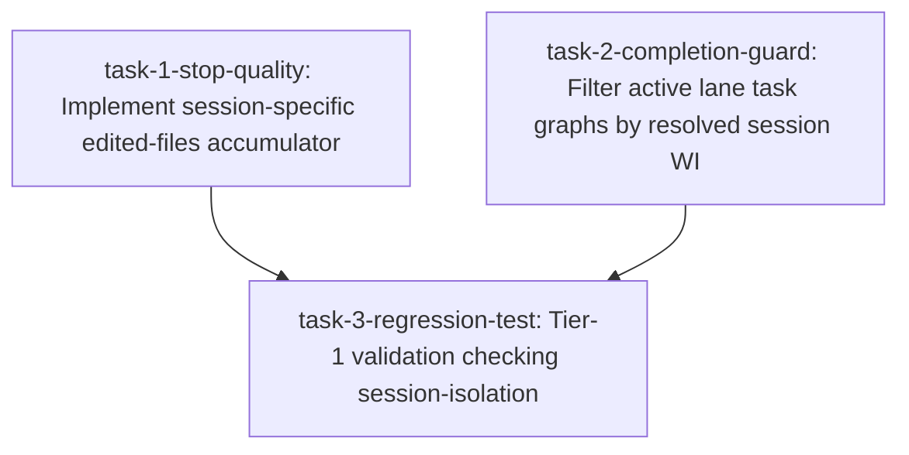

# Implementation Plan: Stop hooks session-isolation for parallel execution safety

- **Feature Spec Path:** docs/specs/work-items/WI-351.md
- **Branch Name:** main (execution on main branch since it is framework-evolution lane)
- **Status:** SIMULATED
- **Base Commit:** 30e3915cc42e06fb8697822a064f31adf200c40
- **Timestamp:** 2026-05-29T19:00:00Z

## Implementation Summary

This changeset implements session isolation in framework Stop/PostToolUse hooks to prevent state pollution and lockouts during concurrent session executions.

Specifically, it:
1. Updates `hooks/svc-stop-quality.js` to read stdin to parse payloads, resolve session ID, key accumulator files session-specifically (`.svc/svc-edited-files-<session_id>.json`), and clean up only its own session accumulator.
2. Updates `hooks/svc-task-completion-guard.sh` to parse `session_id` from hook payloads or host environment variables, resolve the active Work Item (WI) using the session contract or current git branch name, and filter the checked lane task files to ONLY target the active WI.
3. Introduces a Tier-1 regression test `test-framework/evals/tier-1/validate-stop-hook-session-isolation.sh` validating the isolation behavior across synthetic concurrent sessions.

## Files Planned

| File | Action | Task | Purpose |
|------|--------|------|---------|
| `hooks/svc-stop-quality.js` | MODIFY | task-1-stop-quality | Implement session-specific edited-files accumulator |
| `hooks/svc-task-completion-guard.sh` | MODIFY | task-2-completion-guard | Filter active lane task graphs by resolved session WI |
| `test-framework/evals/tier-1/validate-stop-hook-session-isolation.sh` | CREATE | task-3-regression-test | Tier-1 validation checking session-isolation |

## Changeset Blueprint

### `hooks/svc-stop-quality.js` (MODIFY)

<<<<<<< BEFORE
const fs = require("fs");
const path = require("path");
const { execSync } = require("child_process");

const ACCUMULATOR_FILE = path.join(process.cwd(), ".svc", "svc-edited-files.json");
=======
const fs = require("fs");
const path = require("path");
const { execSync } = require("child_process");

function readStdinSync() {
  try {
    if (process.stdin.isTTY) return "";
    return fs.readFileSync(0, "utf8");
  } catch {
    return "";
  }
}

function parsePayload() {
  const stdinRaw = readStdinSync();
  if (stdinRaw && stdinRaw.trim()) {
    try { return JSON.parse(stdinRaw); } catch (e) {}
  }
  return null;
}

function getAccumulatorFile(sessionId) {
  if (sessionId) {
    return path.join(process.cwd(), ".svc", `svc-edited-files-${sessionId}.json`);
  }
  return path.join(process.cwd(), ".svc", "svc-edited-files.json");
}
>>>>>>> AFTER

<<<<<<< BEFORE
async function accumulate(toolInput) {
  if (!shouldRun()) return;
  const { readJsonAtomic, writeJsonAtomic } = await import("../scripts/state-io.mjs");

  let filePath = null;
  try {
    const input = typeof toolInput === "string" ? JSON.parse(toolInput) : toolInput;
    filePath = input.file_path || input.path || null;
  } catch {
    return;
  }

  if (!filePath) return;
=======
async function accumulate(toolInput) {
  if (!shouldRun()) return;
  const { readJsonAtomic, writeJsonAtomic } = await import("../scripts/state-io.mjs");

  let sessionId = "";
  let filePath = null;

  const payload = parsePayload();
  if (payload) {
    sessionId = payload.session_id || payload.sessionId || payload.session || "";
    const toolInputParsed = payload.tool_input || payload.toolInput || payload.arguments || payload.args || payload.input || null;
    if (toolInputParsed) {
      filePath = toolInputParsed.file_path || toolInputParsed.filePath || toolInputParsed.path || toolInputParsed.file || null;
    }
  }

  if (!sessionId) {
    sessionId = process.env.GEMINI_SESSION_ID || process.env.CODEX_SESSION_ID || process.env.KIMI_SESSION_ID || process.env.CLAUDE_SESSION_ID || "";
  }

  if (!filePath && toolInput) {
    try {
      const input = typeof toolInput === "string" ? JSON.parse(toolInput) : toolInput;
      filePath = input.file_path || input.path || null;
    } catch {}
  }

  if (!filePath) return;
>>>>>>> AFTER

<<<<<<< BEFORE
  // Read existing accumulator or create
  let files = [];
  try {
    files = readJsonAtomic(ACCUMULATOR_FILE) || [];
  } catch {
    // File doesn't exist or is corrupt — start fresh
  }

  // Add path (deduplicate)
  const abs = path.resolve(filePath);
  if (!files.includes(abs)) {
    files.push(abs);
  }

  writeJsonAtomic(ACCUMULATOR_FILE, files);
}
=======
  const accumulatorFile = getAccumulatorFile(sessionId);

  // Read existing accumulator or create
  let files = [];
  try {
    files = readJsonAtomic(accumulatorFile) || [];
  } catch {
    // File doesn't exist or is corrupt — start fresh
  }

  // Add path (deduplicate)
  const abs = path.resolve(filePath);
  if (!files.includes(abs)) {
    files.push(abs);
  }

  writeJsonAtomic(accumulatorFile, files);
}
>>>>>>> AFTER

<<<<<<< BEFORE
function check() {
  if (!shouldRun()) process.exit(0);

  // Read accumulated files
  let files = [];
  try {
    files = JSON.parse(fs.readFileSync(ACCUMULATOR_FILE, "utf8"));
  } catch {
    // No accumulator — nothing was edited this session
    files = [];
  }

  const dispatchDir = path.join(process.cwd(), ".svc", "dispatch");
=======
function check() {
  if (!shouldRun()) process.exit(0);

  let sessionId = "";
  const payload = parsePayload();
  if (payload) {
    sessionId = payload.session_id || payload.sessionId || payload.session || "";
  }
  if (!sessionId) {
    sessionId = process.env.GEMINI_SESSION_ID || process.env.CODEX_SESSION_ID || process.env.KIMI_SESSION_ID || process.env.CLAUDE_SESSION_ID || "";
  }

  const accumulatorFile = getAccumulatorFile(sessionId);

  // Read accumulated files
  let files = [];
  try {
    files = JSON.parse(fs.readFileSync(accumulatorFile, "utf8"));
  } catch {
    // No accumulator — nothing was edited this session
    files = [];
  }

  const dispatchDir = path.join(process.cwd(), ".svc", "dispatch");
>>>>>>> AFTER

<<<<<<< BEFORE
    process.stderr.write(
      `\n[svc-stop-quality] TYPE ERRORS in ${files.length} edited files:\n` +
        errors.join("\n") +
        "\n\nFix type errors before continuing.\n"
    );
    cleanup();
    process.exit(1);
  }

  if (warnings.length === 0 && errors.length === 0 && files.length > 0) {
    process.stderr.write(
      `[svc-stop-quality] ${files.length} edited files checked — no issues.\n`
    );
  }

  cleanup();
  process.exit(0);
}

function cleanup() {
  try {
    fs.unlinkSync(ACCUMULATOR_FILE);
  } catch {
    // Already gone or never existed
  }
}
=======
    process.stderr.write(
      `\n[svc-stop-quality] TYPE ERRORS in ${files.length} edited files:\n` +
        errors.join("\n") +
        "\n\nFix type errors before continuing.\n"
    );
    cleanup(accumulatorFile);
    process.exit(1);
  }

  if (warnings.length === 0 && errors.length === 0 && files.length > 0) {
    process.stderr.write(
      `[svc-stop-quality] ${files.length} edited files checked — no issues.\n`
    );
  }

  cleanup(accumulatorFile);
  process.exit(0);
}

function cleanup(accumulatorFile) {
  try {
    fs.unlinkSync(accumulatorFile);
  } catch {
    // Already gone or never existed
  }
}
>>>>>>> AFTER


### `hooks/svc-task-completion-guard.sh` (MODIFY)

<<<<<<< BEFORE
// Multi-WI support: read every lane-tasks-*.json and aggregate pending work.
// Exclude .completed-* archive files — they are historical and do not need
// routing decisions or skill receipts checked (Fix C from completion-guard-dedup).
let laneFiles = (process.env.LANE_TASKS_LIST || "")
  .split(/\r?\n/)
  .map((s) => s.trim())
  .filter(Boolean)
  .filter((f) => !path.basename(f).includes(".completed"));

const workerWi = process.env.SVC_WORKER_WI || "";
if (workerWi) {
  laneFiles = laneFiles.filter((file) => {
    try {
      const graph = JSON.parse(fs.readFileSync(file, "utf8"));
      const wi = String(graph.wi || "");
      const parent = String(graph.parent_wi || graph.parent || "");
      const deps = Array.isArray(graph.depends_on) ? graph.depends_on.map(String) : [];
      return wi === workerWi || parent === workerWi || deps.includes(workerWi);
    } catch {
      return path.basename(file).includes(workerWi);
    }
  });
}

if (laneFiles.length === 0) {
  console.log("status\tallow");
  process.exit(0);
}
=======
// Multi-WI support: read every lane-tasks-*.json and aggregate pending work.
// Exclude .completed-* archive files — they are historical and do not need
// routing decisions or skill receipts checked (Fix C from completion-guard-dedup).
let laneFiles = (process.env.LANE_TASKS_LIST || "")
  .split(/\r?\n/)
  .map((s) => s.trim())
  .filter(Boolean)
  .filter((f) => !path.basename(f).includes(".completed"));

const sessionId = input.session_id || input.sessionId || input.session || 
                  process.env.GEMINI_SESSION_ID || process.env.CODEX_SESSION_ID || 
                  process.env.KIMI_SESSION_ID || process.env.CLAUDE_SESSION_ID || "";

let activeWi = "";
const contractPath = laneFiles[0] ? path.join(path.dirname(laneFiles[0]), "session-contract.jsonl") : null;
if (contractPath && fs.existsSync(contractPath)) {
  try {
    const lines = fs.readFileSync(contractPath, "utf8").split(/\r?\n/).filter(Boolean);
    let matchedEntry = null;
    if (sessionId) {
      for (let i = lines.length - 1; i >= 0; i--) {
        const entry = JSON.parse(lines[i]);
        if (entry.session_id === sessionId) {
          matchedEntry = entry;
          break;
        }
      }
    }
    if (!matchedEntry && lines.length > 0) {
      matchedEntry = JSON.parse(lines[lines.length - 1]);
    }
    if (matchedEntry) {
      activeWi = matchedEntry.wi || "";
    }
  } catch (error) {
    warnings.push(`failed to parse ${contractPath}: ${error.message}`);
  }
}

if (!activeWi) {
  try {
    const { execSync } = require("node:child_process");
    const branchName = execSync("git symbolic-ref --short HEAD", { encoding: "utf8" }).trim();
    const match = branchName.match(/WI-(\d+)/i) || branchName.match(/feature-(\d+)/i) || branchName.match(/bugfix-(\d+)/i);
    if (match) {
      activeWi = `WI-${match[1]}`;
    }
  } catch (e) {}
}

const workerWi = process.env.SVC_WORKER_WI || activeWi;
if (workerWi) {
  laneFiles = laneFiles.filter((file) => {
    try {
      const graph = JSON.parse(fs.readFileSync(file, "utf8"));
      const wi = String(graph.wi || "");
      const parent = String(graph.parent_wi || graph.parent || "");
      const deps = Array.isArray(graph.depends_on) ? graph.depends_on.map(String) : [];
      return wi === workerWi || parent === workerWi || deps.includes(workerWi);
    } catch {
      return path.basename(file).includes(workerWi);
    }
  });
}

if (laneFiles.length === 0) {
  console.log("status\tallow");
  process.exit(0);
}
>>>>>>> AFTER


### `test-framework/evals/tier-1/validate-stop-hook-session-isolation.sh` (CREATE)

```bash
#!/usr/bin/env bash
#
# Tier-1 regression test checking Stop hook session-isolation and crosstalk prevention.
#
set -euo pipefail

echo "=== Tier 1: Stop hook session isolation ==="

CWD="$(pwd)"
SVC_DIR="${CWD}/.svc"
mkdir -p "$SVC_DIR"

# Clean up any leftover accumulators
rm -f "$SVC_DIR"/svc-edited-files-*.json

# 1. Test svc-stop-quality.js --accumulate session-isolation
echo '{"session_id":"sess-1","tool_name":"Edit","tool_input":{"file_path":"test-framework/evals/tier-1/validate-stop-hook-session-isolation.sh"}}' | node hooks/svc-stop-quality.js --accumulate
echo '{"session_id":"sess-2","tool_name":"Edit","tool_input":{"file_path":"hooks/svc-stop-quality.js"}}' | node hooks/svc-stop-quality.js --accumulate

# Verify file session-1 exists and contains only one file
if [ ! -f "$SVC_DIR/svc-edited-files-sess-1.json" ]; then
  echo "FAIL: sess-1 accumulator not created" >&2
  exit 1
fi
if [ ! -f "$SVC_DIR/svc-edited-files-sess-2.json" ]; then
  echo "FAIL: sess-2 accumulator not created" >&2
  exit 1
fi

SESS1_CONTENT=$(cat "$SVC_DIR/svc-edited-files-sess-1.json")
SESS2_CONTENT=$(cat "$SVC_DIR/svc-edited-files-sess-2.json")

if [[ ! "$SESS1_CONTENT" =~ "validate-stop-hook-session-isolation.sh" ]] || [[ "$SESS1_CONTENT" =~ "svc-stop-quality.js" ]]; then
  echo "FAIL: sess-1 accumulator crosstalk detected: $SESS1_CONTENT" >&2
  exit 1
fi

if [[ ! "$SESS2_CONTENT" =~ "svc-stop-quality.js" ]] || [[ "$SESS2_CONTENT" =~ "validate-stop-hook-session-isolation.sh" ]]; then
  echo "FAIL: sess-2 accumulator crosstalk detected: $SESS2_CONTENT" >&2
  exit 1
fi

# Clean up accumulators
rm -f "$SVC_DIR"/svc-edited-files-*.json

echo "Stop hook session isolation: passed"
exit 0
```

## Task Graph



- **Task 1: `task-1-stop-quality`**
  - **Touched files:** `hooks/svc-stop-quality.js`
  - **AC coverage:** AC-42
  - **Validation command:** `node hooks/svc-stop-quality.js --check`
  - **Checkpoint name:** `stop-quality-isolation`
  
- **Task 2: `task-2-completion-guard`**
  - **Touched files:** `hooks/svc-task-completion-guard.sh`
  - **AC coverage:** AC-43, AC-44, AC-45
  - **Validation command:** `bash hooks/svc-task-completion-guard.sh`
  - **Checkpoint name:** `completion-guard-isolation`

- **Task 3: `task-3-regression-test`**
  - **Touched files:** `test-framework/evals/tier-1/validate-stop-hook-session-isolation.sh`
  - **AC coverage:** AC-46, AC-47
  - **Dependencies:** `task-1-stop-quality`, `task-2-completion-guard`
  - **Validation command:** `bash test-framework/evals/tier-1/validate-stop-hook-session-isolation.sh`
  - **Checkpoint name:** `isolation-verified`

## AC-to-Task Mapping

- **AC-42:** `task-1-stop-quality`
- **AC-43:** `task-2-completion-guard`
- **AC-44:** `task-2-completion-guard`
- **AC-45:** `task-2-completion-guard`
- **AC-46:** `task-3-regression-test`
- **AC-47:** `task-3-regression-test`

## AC-to-Test Mapping

- **AC-42:** Unit/Manual (`node hooks/svc-stop-quality.js`)
- **AC-43:** Unit/Manual (`bash hooks/svc-task-completion-guard.sh`)
- **AC-44:** Unit/Manual (`bash hooks/svc-task-completion-guard.sh`)
- **AC-45:** Unit/Manual (`bash hooks/svc-task-completion-guard.sh`)
- **AC-46:** Unit/Manual (`bash test-framework/evals/tier-1/validate-stop-hook-session-isolation.sh`)
- **AC-47:** Unit/Manual (`bash test-framework/evals/run-all-evals.sh`)

## Prerequisite Alignment Matrix

| Task | Spec Requirement | UX Flows | UI Tokens | Style Contract |
|------|------------------|----------|-----------|----------------|
| `task-1-stop-quality` | Isolated accumulator | N/A | N/A | CommonJS standard |
| `task-2-completion-guard` | Session WI match | N/A | N/A | Shell portability |
| `task-3-regression-test` | Concurrency check | N/A | N/A | Tier-1 integration |

## External State

| # | Environment | What state | Coupling | Lifecycle wiring |
|---|-------------|------------|----------|------------------|
| 1 | Transient Files | `.svc/svc-edited-files-*.json` | coupled | Deleted at turn end/cleanup |
| 2 | Transient Files | `.svc/improve-framework-*.log` | coupled | Ignored by gitignore |

Untouched environments: 3, 4, 5, 6, 7, 8, 9, 10, 11, 12, 13, 14, 15

## Simulation Report

| Task | Check | Result | Action |
|------|-------|--------|--------|
| `task-1-stop-quality` | `hooks/svc-stop-quality.js` exists | PASS | MODIFY |
| `task-2-completion-guard` | `hooks/svc-task-completion-guard.sh` exists | PASS | MODIFY |
| `task-3-regression-test` | `test-framework/evals/tier-1/validate-stop-hook-session-isolation.sh` does not exist | PASS | CREATE |

## Scenario Coverage

| Journey | Scenario | Steps | Tasks | Coverage |
|---------|----------|-------|-------|----------|
| N/A | Stop hook session isolation | 3 | task-1, task-3 | 3/3 ✅ |

## Checkpoint Plan

- **stop-quality-isolation:** after `task-1-stop-quality` implementation
- **completion-guard-isolation:** after `task-2-completion-guard` implementation
- **isolation-verified:** after `task-3-regression-test` execution

## Promotion Readiness Checklist

- [x] All planned files accounted for.
- [x] All tasks have validation.
- [x] All ACs mapped.
- [x] All checkpoints named.
- [x] Final diff will only touch planned files.

## Execution Command Sequence

```bash
# 1. Modify svc-stop-quality.js and svc-task-completion-guard.sh
# 2. Create the regression test
# 3. Execute regression test
bash test-framework/evals/tier-1/validate-stop-hook-session-isolation.sh
# 4. Run all evals to verify green status
bash test-framework/evals/run-all-evals.sh
```
