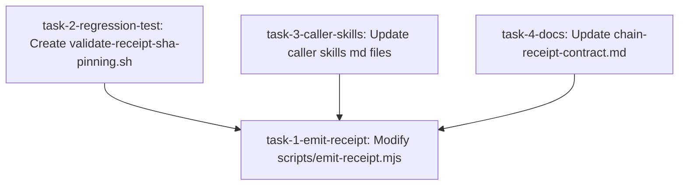

# Implementation Plan: Receipt-Emission --sha Pinning (WI-349)

- **Feature Spec Path:** [WI-349.md](file:///workspace/seriousvibecoding/docs/specs/work-items/WI-349.md)
- **Branch Name:** `feature-receipt-sha-pinning`
- **Status:** DRAFTED
- **Base Branch:** `main`
- **Base SHA:** `53d98d5330e7041a021ff7c97fb87b901a1b411d`
- **Creation Timestamp:** `2026-05-29T08:03:19Z`

---

## 1. Implementation Summary

This plan introduces explicit commit SHA pinning to the one-call receipt emitter (`scripts/emit-receipt.mjs`). By requiring a `--sha <sha>` flag and updating all pipeline caller skills to explicitly pass this SHA, we ensure that receipt files and git notes are associated with the correct commit even when concurrent checkout sessions or subagents switch the workspace HEAD mid-run.

### Invariants:
- Schema validation of all receipt payloads against their JSON schemas.
- Atomic state file writing via tempfile rename and fsync.
- Safe serialization of concurrent writes using the workspace lock Sentinel.

---

## 2. Files Planned

| File | Action | Task | Purpose |
|------|--------|------|---------|
| `scripts/emit-receipt.mjs` | MODIFY | `task-1-emit-receipt` | Add `--sha` flag, validation, and log deprecation warning on fallback. |
| `test-framework/evals/tier-1/validate-receipt-sha-pinning.sh` | CREATE | `task-2-regression-test` | Tier-1 test validating explicit `--sha` binding. |
| `plan-changeset/SKILL.md` | MODIFY | `task-3-caller-skills` | Update receipt emission to capture and pass `--sha`. |
| `review-plan/SKILL.md` | MODIFY | `task-3-caller-skills` | Update receipt emission to capture and pass `--sha`. |
| `execute-changeset/SKILL.md` | MODIFY | `task-3-caller-skills` | Update receipt emission to capture and pass `--sha`. |
| `review-cross-model/SKILL.md` | MODIFY | `task-3-caller-skills` | Update receipt emission to capture and pass `--sha`. |
| `audit-implementation/SKILL.md` | MODIFY | `task-3-caller-skills` | Update receipt emission to capture and pass `--sha`. |
| `verify-promotion/SKILL.md` | MODIFY | `task-3-caller-skills` | Update receipt emission to capture and pass `--sha`. |
| `references/chain-receipt-contract.md` | MODIFY | `task-4-docs` | Update documentation to reflect the new `--sha` contract. |

---

## 3. Changeset Blueprints

### `scripts/emit-receipt.mjs`

```markdown
<<<<<<< BEFORE
import { execSync } from "node:child_process";
import { readFileSync, writeFileSync, existsSync, mkdirSync, unlinkSync, readdirSync } from "node:fs";
import { join } from "node:path";
import { tmpdir } from "node:os";
import { writeJsonAtomic } from "./state-io.mjs";
import { acquireLock } from "./state-lock.mjs";
=======
import { execSync } from "node:child_process";
import { readFileSync, writeFileSync, existsSync, mkdirSync, unlinkSync, readdirSync } from "node:fs";
import { join } from "node:path";
import { tmpdir } from "node:os";
import { writeJsonAtomic, appendJsonlLine } from "./state-io.mjs";
import { acquireLock } from "./state-lock.mjs";
>>>>>>> AFTER

<<<<<<< BEFORE
function parseArgs(argv) {
  const out = { type: null, wi: null, body: null, noNote: false };
  for (let i = 0; i < argv.length; i++) {
    const a = argv[i];
    if (a === "--type") out.type = argv[++i];
    else if (a === "--wi") out.wi = argv[++i];
    else if (a === "--body") out.body = argv[++i];
    else if (a === "--no-note") out.noNote = true;
  }
  return out;
}
=======
function parseArgs(argv) {
  const out = { type: null, wi: null, body: null, noNote: false, sha: null };
  for (let i = 0; i < argv.length; i++) {
    const a = argv[i];
    if (a === "--type") out.type = argv[++i];
    else if (a === "--wi") out.wi = argv[++i];
    else if (a === "--body") out.body = argv[++i];
    else if (a === "--no-note") out.noNote = true;
    else if (a === "--sha") out.sha = argv[++i];
  }
  return out;
}
>>>>>>> AFTER

<<<<<<< BEFORE
  const headExists = git("rev-parse --verify HEAD 2>/dev/null");
  const writeStaging = !headExists;
  const treeHash = git("write-tree");

  let mirrorPath;
  if (writeStaging) {
    if (!treeHash) fail("could not compute tree hash for staging");
    const dir = join(".svc", "receipts", "staging", treeHash);
    mkdirSync(dir, { recursive: true });
    mirrorPath = join(dir, `${args.type}.json`);
  } else {
    const shortSha = headExists.substring(0, 7);
    const dir = join(".svc", "receipts", shortSha);
    mkdirSync(dir, { recursive: true });
    mirrorPath = join(dir, `${args.type}.json`);
  }

  writeJsonAtomic(mirrorPath, body);

  let noteWritten = false;
  if (!args.noNote && headExists) {
    noteWritten = writeNote(headExists, args.type, body);
  }
=======
  let targetSha = args.sha;
  let writeStaging = false;

  if (targetSha) {
    const resolved = git(`rev-parse --verify ${targetSha} 2>/dev/null`);
    if (!resolved) {
      fail(`provided --sha '${targetSha}' is not a valid commit in git`, 2);
    }
    targetSha = resolved;
  } else {
    targetSha = git("rev-parse --verify HEAD 2>/dev/null");
    writeStaging = !targetSha;

    if (targetSha) {
      try {
        appendJsonlLine(".svc/pipeline-decisions.jsonl", {
          timestamp: new Date().toISOString(),
          run_id: args.wi,
          skill: "emit-receipt",
          type: "mechanical",
          decision: "deprecation-warning",
          reasoning: `Implicit checkout HEAD resolution was used because --sha was not provided for receipt type '${args.type}'. This fallback is deprecated to prevent concurrent checkout session collision receipt mis-routing.`,
          decided_by: "P0",
          overrideable: false
        });
      } catch (e) {
        console.warn(`emit-receipt warning: failed to write deprecation entry to pipeline-decisions.jsonl: ${e.message}`);
      }
    }
  }

  const treeHash = git("write-tree");

  let mirrorPath;
  if (writeStaging) {
    if (!treeHash) fail("could not compute tree hash for staging");
    const dir = join(".svc", "receipts", "staging", treeHash);
    mkdirSync(dir, { recursive: true });
    mirrorPath = join(dir, `${args.type}.json`);
  } else {
    const shortSha = targetSha.substring(0, 7);
    const dir = join(".svc", "receipts", shortSha);
    mkdirSync(dir, { recursive: true });
    mirrorPath = join(dir, `${args.type}.json`);
  }

  writeJsonAtomic(mirrorPath, body);

  let noteWritten = false;
  if (!args.noNote && targetSha) {
    noteWritten = writeNote(targetSha, args.type, body);
  }
>>>>>>> AFTER
```

### `plan-changeset/SKILL.md`

```markdown
<<<<<<< BEFORE
## Chain Receipt Emission (Mandatory Chain — Actionable)

After producing the canonical output, emit a SHA-keyed receipt:

```bash
cat <<'JSON' | node scripts/emit-receipt.mjs --type plan-manifest --wi $WI
{
  "wi": "$WI",
  ...the WI's plan-manifest JSON (scope, dependencies, decision_trace, task_graph, validation_plan, risk_rollback)
}
JSON
```
=======
## Chain Receipt Emission (Mandatory Chain — Actionable)

After producing the canonical output, emit a SHA-keyed receipt:

```bash
BASE_SHA="$(git rev-parse HEAD)"
cat <<'JSON' | node scripts/emit-receipt.mjs --type plan-manifest --wi $WI --sha "$BASE_SHA"
{
  "wi": "$WI",
  ...the WI's plan-manifest JSON (scope, dependencies, decision_trace, task_graph, validation_plan, risk_rollback)
}
JSON
```
>>>>>>> AFTER
```

### `review-plan/SKILL.md`

```markdown
<<<<<<< BEFORE
## Chain Receipt Emission (Mandatory Chain — Actionable)

After producing the canonical output, emit a SHA-keyed receipt:

```bash
cat <<'JSON' | node scripts/emit-receipt.mjs --type review-plan --wi $WI
{
  "wi": "$WI",
  ...{self_review, adversarial_review, verdict}
}
JSON
```
=======
## Chain Receipt Emission (Mandatory Chain — Actionable)

After producing the canonical output, emit a SHA-keyed receipt:

```bash
BASE_SHA="$(git rev-parse HEAD)"
cat <<'JSON' | node scripts/emit-receipt.mjs --type review-plan --wi $WI --sha "$BASE_SHA"
{
  "wi": "$WI",
  ...{self_review, adversarial_review, verdict}
}
JSON
```
>>>>>>> AFTER
```

### `execute-changeset/SKILL.md`

```markdown
<<<<<<< BEFORE
## Chain Receipt Emission (Mandatory Chain — Actionable)

After producing the canonical output, emit a SHA-keyed receipt:

```bash
cat <<'JSON' | node scripts/emit-receipt.mjs --type exec-record --wi $WI
{
  "wi": "$WI",
  ...{diff_hash, files_touched, dispatch_model, test_results}
}
JSON
```
=======
## Chain Receipt Emission (Mandatory Chain — Actionable)

After producing the canonical output, emit a SHA-keyed receipt:

```bash
BASE_SHA="$(git rev-parse HEAD)"
cat <<'JSON' | node scripts/emit-receipt.mjs --type exec-record --wi $WI --sha "$BASE_SHA"
{
  "wi": "$WI",
  ...{diff_hash, files_touched, dispatch_model, test_results}
}
JSON
```
>>>>>>> AFTER
```

### `review-cross-model/SKILL.md`

```markdown
<<<<<<< BEFORE
## Chain Receipt Emission (Mandatory Chain — Actionable)

After producing the canonical output, emit a SHA-keyed receipt:

```bash
cat <<'JSON' | node scripts/emit-receipt.mjs --type review-plan --wi $WI
{
  "wi": "$WI",
  ...{self_review, adversarial_review, verdict} — use --type review-plan when run pre-exec or --type review-exec when run post-exec
}
JSON
```
=======
## Chain Receipt Emission (Mandatory Chain — Actionable)

After producing the canonical output, emit a SHA-keyed receipt:

```bash
BASE_SHA="$(git rev-parse HEAD)"
cat <<'JSON' | node scripts/emit-receipt.mjs --type review-plan --wi $WI --sha "$BASE_SHA"
{
  "wi": "$WI",
  ...{self_review, adversarial_review, verdict} — use --type review-plan when run pre-exec or --type review-exec when run post-exec
}
JSON
```
>>>>>>> AFTER
```

### `audit-implementation/SKILL.md`

```markdown
<<<<<<< BEFORE
## Chain Receipt Emission (Mandatory Chain — Actionable)

After producing the canonical output, emit a SHA-keyed receipt:

```bash
cat <<'JSON' | node scripts/emit-receipt.mjs --type audit-implementation --wi $WI
{
  "wi": "$WI",
  ...{verdict, findings, ac_coverage}
}
JSON
```
=======
## Chain Receipt Emission (Mandatory Chain — Actionable)

After producing the canonical output, emit a SHA-keyed receipt:

```bash
BASE_SHA="$(git rev-parse HEAD)"
cat <<'JSON' | node scripts/emit-receipt.mjs --type audit-implementation --wi $WI --sha "$BASE_SHA"
{
  "wi": "$WI",
  ...{verdict, findings, ac_coverage}
}
JSON
```
>>>>>>> AFTER
```

### `verify-promotion/SKILL.md`

```markdown
<<<<<<< BEFORE
## Chain Receipt Emission (Mandatory Chain — Actionable)

After producing the canonical output, emit a SHA-keyed receipt:

```bash
cat <<'JSON' | node scripts/emit-receipt.mjs --type verify-promotion --wi $WI
{
  "wi": "$WI",
  ...{passes, p3_target_type, p3_outcome, verdict}
}
JSON
```
=======
## Chain Receipt Emission (Mandatory Chain — Actionable)

After producing the canonical output, emit a SHA-keyed receipt:

```bash
BASE_SHA="$(git rev-parse HEAD)"
cat <<'JSON' | node scripts/emit-receipt.mjs --type verify-promotion --wi $WI --sha "$BASE_SHA"
{
  "wi": "$WI",
  ...{passes, p3_target_type, p3_outcome, verdict}
}
JSON
```
>>>>>>> AFTER
```

### `references/chain-receipt-contract.md`

```markdown
<<<<<<< BEFORE
## Emit Pattern (Same for All Skills)

```bash
SHORT_SHA="$(git rev-parse --short HEAD)"
MIRROR_DIR=".svc/receipts/$SHORT_SHA"
mkdir -p "$MIRROR_DIR"

# Build receipt object matching the schema for this type
cat > "$MIRROR_DIR/<receipt-type>.json" <<EOF
{
  "receipt_type": "<receipt-type>",
  "schema_version": 1,
  ...other fields per schema...,
  "timestamp": "$(date -u +%Y-%m-%dT%H:%M:%SZ)"
}
EOF

# Update consolidated git note (merge into envelope)
ENV="$(git notes --ref=svc-receipts show "$(git rev-parse HEAD)" 2>/dev/null || echo '{}')"
NEW_ENV="$(echo "$ENV" | jq --argjson r "$(cat "$MIRROR_DIR/<receipt-type>.json")" \
  '. + {"<receipt-type>": $r}')"
echo "$NEW_ENV" | git notes --ref=svc-receipts add -f -F - "$(git rev-parse HEAD)"
```
=======
## Emit Pattern (Same for All Skills)

```bash
BASE_SHA="$(git rev-parse HEAD)"
SHORT_SHA="${BASE_SHA:0:7}"
MIRROR_DIR=".svc/receipts/$SHORT_SHA"
mkdir -p "$MIRROR_DIR"

# Build receipt object matching the schema for this type
cat > "$MIRROR_DIR/<receipt-type>.json" <<EOF
{
  "receipt_type": "<receipt-type>",
  "schema_version": 1,
  ...other fields per schema...,
  "timestamp": "$(date -u +%Y-%m-%dT%H:%M:%SZ)"
}
EOF

# Update consolidated git note (merge into envelope)
ENV="$(git notes --ref=svc-receipts show "$BASE_SHA" 2>/dev/null || echo '{}')"
NEW_ENV="$(echo "$ENV" | jq --argjson r "$(cat "$MIRROR_DIR/<receipt-type>.json")" \
  '. + {"<receipt-type>": $r}')"
echo "$NEW_ENV" | git notes --ref=svc-receipts add -f -F - "$BASE_SHA"
```

## Alternate One-Call Emitter Pattern (Recommended)

Skills may invoke the one-call receipt emitter script passing the explicit SHA:

```bash
BASE_SHA="$(git rev-parse HEAD)"
cat <<'JSON' | node scripts/emit-receipt.mjs --type <receipt-type> --wi $WI --sha "$BASE_SHA"
{
  "wi": "$WI",
  ...receipt body matching schema...
}
JSON
```
>>>>>>> AFTER
```

### `test-framework/evals/tier-1/validate-receipt-sha-pinning.sh` (CREATE)

```bash
#!/usr/bin/env bash
# Tier-1: receipt emission correctly pins to --sha under checkout HEAD shifts.
set -euo pipefail

REPO_ROOT="$(git rev-parse --show-toplevel 2>/dev/null || pwd)"
cd "$REPO_ROOT"

# Use the commit before HEAD (HEAD~1) as the test target
TARGET_COMMIT="$(git rev-parse HEAD~1 2>/dev/null || echo '')"
if [[ -z "$TARGET_COMMIT" ]]; then
  echo "PASS: Less than 2 commits in repository, skipping --sha pinning test"
  exit 0
fi

SHORT_TARGET="${TARGET_COMMIT:0:7}"
MIRROR_FILE=".svc/receipts/${SHORT_TARGET}/quick-fix.json"

# Clean up any existing receipt for the target commit
rm -f "$MIRROR_FILE"

# Run emit-receipt.mjs with explicit --sha
echo '{
  "receipt_type": "quick-fix",
  "schema_version": 1,
  "tree_hash": "abcdef0123456789",
  "eligible": true,
  "reasons": ["testing sha pinning"],
  "files": ["test.js"],
  "timestamp": "2026-05-29T08:03:19Z"
}' | node scripts/emit-receipt.mjs --type quick-fix --wi WI-349 --sha "$TARGET_COMMIT" --no-note > /dev/null

# Assert that the receipt was written to the specified SHA's directory
if [[ ! -f "$MIRROR_FILE" ]]; then
  echo "FAIL: Receipt was not written to target --sha directory: $MIRROR_FILE"
  exit 1
fi

# Clean up
rm -f "$MIRROR_FILE"

echo "PASS: Receipt correctly pinned to --sha target commit"
exit 0
```

---

## 4. Task Graph



### Task Details:

#### `task-1-emit-receipt`
- **Title:** Implement `--sha` flag and validation in `emit-receipt.mjs`
- **Touched Files:** `scripts/emit-receipt.mjs`
- **Dependencies:** None
- **AC Coverage:**
  - AC-01: accepts `--sha` flag and uses it.
  - AC-02: logs deprecation entry to `.svc/pipeline-decisions.jsonl` if `--sha` is missing.
- **Validation Command:** `node --check scripts/emit-receipt.mjs`
- **Checkpoint:** `checkpoint-task-1`

#### `task-2-regression-test`
- **Title:** Create Tier-1 regression validator for `--sha` pinning
- **Touched Files:** `test-framework/evals/tier-1/validate-receipt-sha-pinning.sh`
- **Dependencies:** `task-1-emit-receipt`
- **AC Coverage:**
  - AC-05: regression test verifies `--sha` pinning.
- **Validation Command:** `bash test-framework/evals/tier-1/validate-receipt-sha-pinning.sh`
- **Checkpoint:** `checkpoint-task-2`

#### `task-3-caller-skills`
- **Title:** Update all pipeline chain skills to pass explicit `--sha`
- **Touched Files:**
  - `plan-changeset/SKILL.md`
  - `review-plan/SKILL.md`
  - `execute-changeset/SKILL.md`
  - `review-cross-model/SKILL.md`
  - `audit-implementation/SKILL.md`
  - `verify-promotion/SKILL.md`
- **Dependencies:** `task-1-emit-receipt`
- **AC Coverage:**
  - AC-03: capture `BASE_SHA` once at start of runs and pass to `--sha`.
- **Validation Command:** `node scripts/validate-task-graph-lane.mjs .svc/lane-tasks-WI-349.json`
- **Checkpoint:** `checkpoint-task-3`

#### `task-4-docs`
- **Title:** Update chain receipt contract reference documentation
- **Touched Files:** `references/chain-receipt-contract.md`
- **Dependencies:** `task-1-emit-receipt`
- **AC Coverage:**
  - AC-04: update `chain-receipt-contract.md` with `--sha` requirement.
- **Validation Command:** `node scripts/lint-skills-manifest.mjs` (manifest/README integrity checks)
- **Checkpoint:** `checkpoint-task-4`

---

## 5. AC-to-Task Mapping

| AC | Description | Task(s) | Test Type |
|----|-------------|---------|-----------|
| AC-01 | `emit-receipt.mjs` accepts `--sha <sha>` and uses it as target. | `task-1-emit-receipt` | Unit |
| AC-02 | Logs deprecation entry to `.svc/pipeline-decisions.jsonl` if `--sha` omitted. | `task-1-emit-receipt` | Unit |
| AC-03 | Chain skills capture `BASE_SHA=$(git rev-parse HEAD)` and pass to emit-receipt. | `task-3-caller-skills` | Static / Lint |
| AC-04 | Update `references/chain-receipt-contract.md` to document the requirement. | `task-4-docs` | Docs |
| AC-05 | Regression test verifies correct binding under dynamic HEAD shifts. | `task-2-regression-test` | Unit |

---

## 6. Prerequisite Alignment Matrix

| Task | UX Spec | UI Spec | Tech Design | Style Contract |
|------|---------|---------|-------------|----------------|
| `task-1-emit-receipt` | N/A | N/A | Schema alignment | state-io.mjs patterns |
| `task-2-regression-test` | N/A | N/A | Test framework | Standard shell script conventions |
| `task-3-caller-skills` | N/A | N/A | Skill metadata | Markdown syntax standards |
| `task-4-docs` | N/A | N/A | Schema docs | Markdown syntax standards |

---

## Prerequisite Alignment Matrix

| # | Domain | Required standard | Alignment verification |
|---|--------|-------------------|------------------------|
| 1 | Style Contract | `scripts/emit-receipt.mjs` conforms to the style contract | Checked via `verify-plan-mechanical` and static checks |

---

## External State

| # | Environment | What state | Coupling | Lifecycle wiring |
|---|-------------|------------|----------|------------------|
| 1 | `refs/notes/svc-receipts` | Durable git notes storing commit receipts | Coupled | Validated via `check-chain-receipts.mjs` during push / preflight checks |

---

## Execution Command Sequence

```bash
# task-1
node --check scripts/emit-receipt.mjs

# task-2
bash test-framework/evals/tier-1/validate-receipt-sha-pinning.sh
```

---

## 7. Validation Plan

### Task-level Validation Commands:
- `task-1-emit-receipt`: `node --check scripts/emit-receipt.mjs`
- `task-2-regression-test`: `bash test-framework/evals/tier-1/validate-receipt-sha-pinning.sh`
- `task-3-caller-skills`: `bash test-framework/evals/tier-1/validate-skill-structure.sh`
- `task-4-docs`: `bash test-framework/evals/tier-1/validate-contracts.sh`

### Final Branch-level Validation:
- `bash test-framework/evals/run-all-evals.sh` (Runs the full suite of 180+ static validators)

---

## 8. Checkpoint & Rollback Plan

- **Checkpoints:**
  1. `checkpoint-task-1`: `git commit -am "feat(receipts): implement --sha pinning flag in emit-receipt.mjs"`
  2. `checkpoint-task-2`: `git commit -am "test(receipts): add Tier-1 regression test for --sha pinning"`
  3. `checkpoint-task-3`: `git commit -am "feat(skills): update caller skills to capture and pass BASE_SHA"`
  4. `checkpoint-task-4`: `git commit -am "docs(receipts): document --sha pinning contract in chain-receipt-contract.md"`
- **Rollback Anchors:** Standard `git checkout -- <file>` or `git reset --hard HEAD~1` within the feature worktree.

---

## 9. Simulation Report

| Task | Check | Result | Action |
|------|-------|--------|--------|
| `task-1-emit-receipt` | `scripts/emit-receipt.mjs` exists | PASS | Proceed with modifications |
| `task-2-regression-test` | `test-framework/evals/tier-1/` exists | PASS | Proceed with CREATE |
| `task-3-caller-skills` | Skills files exist and contain `emit-receipt` references | PASS | Proceed with modifications |
| `task-4-docs` | `references/chain-receipt-contract.md` exists | PASS | Proceed with modifications |

---

## 10. Scenario Coverage

| Journey | Scenario | Steps | Tasks | Coverage |
|---------|----------|-------|-------|----------|
| WI-349-J01 | Dynamic HEAD receipt emission | 5 | task-1, task-2 | 5/5 ✅ |
| WI-349-J02 | Callers alignment | 4 | task-3, task-4 | 4/4 ✅ |
