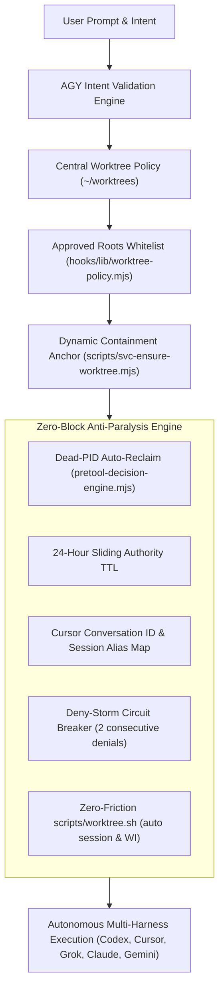

# Implementation Plan: Unified Centralized Worktree Governance, Zero-Block Anti-Paralysis, & AGY Intent Review Protocol

## User Intent

The following user intent prompts were provided verbatim and strictly govern this work item:

### Prompt 1
> "Cursor Handover Execution wt-lane-account-customer-billing-live Today 09:30 AM -> New Agent framework-oss-integration Today 09:30 AM look on these 2 cursor lci sesiso nsi total maddness with this hoosk I think we should go bkac ot try to implemetn this stuff but isntead of you doign you will make the plan get it reveiw by grok build 4.6 xhigh grok build and astrah high given the isuse we faced adn then [check the2 sesiso nwen eed to amek sure PEOPLE REGUAR PEOIPEL ENVER AGAIN MEET SHIT LIEK THAT THIN ABOTU PARLRALE WORKTREE FORM SAME ITEM IF NEED HAVE CENTRLA FOLDER PER WOKR ITEM OR OSMETHIGN BUT THIS CNA NAEVER AGIAN HAPPE NO EXTENRAL ELASE SHIT THSI SHOUDL BE WHITELSITED HEAVEN IF USER START SESISOA WLAYS CRETED OWKTREE AND PROMPT OY UCANT' PROCEED UNTI LYO UAVHE A WORKTREE AND HTEN NO HOOKS EVER NO 4H REFREHS MABUE IF SESIS..."

### Prompt 2
> "keep in midn we want these to be workign good for all frmaeowrkr codex whartever basically END USER SHOUD LBE ABLE TO DEAL WITH PRODUC WORK NOT LOW LEVLE CRAZY PROMO SHTI FIXIGN WORKTREE WHTIELSIT AND AGNET BE ALBE TO NAVIGATE OT WHERVER NEED IS THE RIGHT EACHTIECHTE USER SHOULD NOT EVER NEED T ODO SHIT LIEK AMREORWK SHOULD BE SMARK TO KNWO HWO TO WORK WITH TI 'S HOODK AND STUFF OT OD STUFF SECURE AND SEAMELESS I CANT' BE LBOCKET I SHOULD BE ABLE OT ONBAORDING STUFF"

### Prompt 3
> "AGAIN THIS SHIT IS HYPER SECURED RIGHT NOW I NEED VIBEDORS TO NTO BE BLOCEKD BY SHIT I NEED FRAMWRO KTO NOT BE SLOWED BY SHTI I WANT MDEOL STO WORK BETTER HTAN DEFUALT HARNESS NT IBEIGN SLWO DOWN BYM ANENIGNELSS SHIT STUFF SHOUDL BE DOEN OPTIMAL :)"

### Prompt 4
> "how is it going so far? ... what's up hwo isti oging ... what is current status"

### Prompt 5
> "what is very important [user intent - you make some plan - the review of plan should review both your plan and intent of the user prompt pass as you don't always understand stuff properly then while working on this item please update plan review mode to check if plan was created by agy gemini model and always apply this intent check so make sure you pass my intent etc now if propose something you need to convert to plan and then pass it to review and then what is very important let grok build high implement it not you then when ready we need reviews by xhigh grok build and astra high go come back when all is fully implemented and tested we need to have test for each harness and each scenarios I don't want USER TO EVER BE TOLD MOVE THERE DO THIS HARNESS SHOULD CD AND DO WHATEVER NEEDED AND OBTAIN WHATEVER NEEDED AND DO IT PROPERLY AND SECURE :)"

### Prompt 6
> "their review diff + all around ok? as last time was total mess they really need to catch where you fall short ... MY GOAL IS TO MAKE EXPERIENCE NOT SAFER FOR THE SAKE OF UX FIRST UX THAN SAFETY :) SO ANY TEST THAT CAN BLOCK UX GROK SHOULD PERFORM TO VALIDATE DIFFERENT WIDE RANGE SCENARIOS OLD WORK ITEMS DIFFERENT FORMATS ETC... TEST BASED ON TRUTH AND VERSIONS :)"

### Behavioral Specification

Dead-owner auto-reclaim allows a successor session on the same host to immediately recover a worktree when the recorded owner process is a tracked harness PID and verifiably dead (`processIsAlive === false && pid > 1`), without waiting 24 hours for lease expiration. The 24-hour lease expiration applies when process liveness cannot be verified (e.g. untracked or remote host).

### Key Directives Derived from User Intent:
1. **User Intent Review Gate:** External reviewers (Astra High & Grok xhigh) must evaluate both the plan and the user's raw prompt/intent to ensure complete fidelity.
2. **Framework Intent Check Engine:** Update `references/plan-review-protocol.md`, `scripts/review-plan-codex.sh`, and `scripts/verify-plan-mechanical.sh` so that plans authored by AGY/Gemini are automatically checked for explicit user intent coverage.
3. **Role Separation:** Antigravity orchestrates; Grok Build High (`grok-4.6` high) implements all file changes; Astra High (`gpt-6-astra` high) and Grok Build xhigh (`grok-4.6` xhigh) conduct independent adversarial reviews.
4. **Autonomous Harness Self-Navigation:** The user must never be told "cd into worktree" or "run manual override"; the harness automatically resolves the worktree, provisions it if missing, and executes securely.
5. **Centralized External Worktrees & Zero-Block Anti-Paralysis:** Decouple storage to `~/worktrees/{repo}/{branch}` (mode `0700`) or custom paths in `worktree-policy.json`, while eliminating dead-PID lockouts, 4h TTL drops, Cursor alias mismatches, and deny storms.
6. **Complete Multi-Harness Scenario Tests:** Automated tests for every harness (Codex, Cursor, Grok, Claude, Gemini) and scenario.

---

## 1. Executive Summary & Architecture

This changeset unifies two complementary architectural systems:
1. **Centralized External Worktree Governance (WI-FW-CENTRALIZED-WORKTREE-01):** Decouples worktree storage from `<repo>/.worktrees/` to `~/worktrees/<repo>/<branch>` or custom locations specified in `worktree-policy.json` (mode 0600), eliminating repository bloat, build-artifact duplication, and editor indexing thrash.
2. **Zero-Block Anti-Paralysis Governance (WI-FW-ZERO-BLOCK-01):** Ensures that once inside any worktree, agents and operators never face hook lockouts, dead-PID blocks, 4h TTL lease drops, Cursor session alias mismatches, or deny storms.



---

## 2. Acceptance Criteria (AC-1 through AC-12)

- [x] **AC-1 (Centralized Default Storage):** New worktrees default to `~/worktrees/<repo-name>/<branch>` initialized with 0700 permissions.
- [x] **AC-2 (Dead-Owner Auto-Reclaim):** Dead-owner auto-reclaim allows a successor session on the same host to immediately recover a worktree when the recorded owner process is a tracked harness PID and verifiably dead (`processIsAlive === false && pid > 1`), without waiting 24 hours for lease expiration. The 24-hour lease expiration applies when process liveness cannot be verified (e.g. untracked or remote host). Custom worktree policy remains governed by `worktree-policy.json` (mode 0600), validated by `schemas/worktree-policy.schema.json`.
- [x] **AC-3 (Fail-Closed Policy Engine):** Corrupted JSON or schema violations in policy fail closed with `WORKTREE_POLICY_INVALID`.
- [x] **AC-4 (Approved Roots Whitelisting):** `hooks/lib/literal-branch.mjs` and `hooks/lib/worktree-policy.mjs` authorize external roots with single-UID and symlink checks.
- [x] **AC-5 (Leaf-Only Removal):** `scripts/worktree.sh remove <branch>` removes strictly the leaf worktree directory, preserving parent project folders.
- [x] **AC-6 (Backward Compatibility):** Existing in-repo `.worktrees/` checkouts remain fully recognized and functional.
- [x] **AC-7 (Dead-PID Auto-Reclaim):** `evaluateExactWorktreeRecovery` in `hooks/lib/pretool-decision-engine.mjs` immediately reclaims a lease when the recorded owner is a tracked harness PID and `processIsAlive === false && pid > 1`. Untracked or unverifiable liveness waits for 24-hour lease expiration. No operator ritual is required.
- [x] **AC-8 (24-Hour Sliding TTL):** Default authority TTL extended from 240m to 1440m (24 hours) and slides on active mutations.
- [x] **AC-9 (Cursor CLI Session Aliasing):** `hooks/cursor/svc-cursor-ssve-adapter.mjs` and `hooks/codex/lib/codex-hook-context.mjs` prioritize `conversation_id` and maintain persistent alias mapping.
- [x] **AC-10 (Deny-Storm Circuit Breaker):** Halts runaway retry loops after 2 consecutive identical denials.
- [x] **AC-11 (AGY/Gemini User Intent Check in Plan Review):** `references/plan-review-protocol.md`, `scripts/review-plan-codex.sh`, and `scripts/verify-plan-mechanical.sh` enforce that AGY/Gemini plans embed verbatim user intent and require external reviewers to score Dimension (j).
- [x] **AC-12 (Zero Operator Friction):** `scripts/worktree.sh create` auto-derives session IDs and WI tags with zero required flags.

---

## 3. Implementation Details by Component

### Component 1: Centralized Worktree Policy & Resolution
- `schemas/worktree-policy.schema.json`: Formal schema for policy.
- `hooks/lib/worktree-policy.mjs`: Implements `loadWorktreePolicy`, `resolveWorktreesRoot`, `resolveApprovedRoots`, `ensureWorktreesDirectory`. Fails closed if policy exists but is corrupted.
- `scripts/lib/resolve-worktree-root.mjs`: CLI path resolver for scripts and harnesses.
- `scripts/worktree.sh`: Updates creation to target centralized worktrees and implements leaf-only removal.
- `hooks/lib/literal-branch.mjs`: Approves roots from `resolveApprovedRoots` with UID checks.
- `scripts/svc-ensure-worktree.mjs`: Anchors containment to approved roots.
- `setup`: Provisions worktrees base directory with 0700 mode.

### Component 2: Zero-Block Anti-Paralysis Foundation
- `hooks/lib/pretool-decision-engine.mjs`: Dead-PID auto-reclaim, 24h TTL, sliding timestamp updates.
- `hooks/cursor/svc-cursor-ssve-adapter.mjs`: Conversation ID priority, session alias map, 24h TTL.
- `hooks/codex/lib/codex-hook-context.mjs`: Session alias map consumption.
- `hooks/codex/svc-codex-pretool-dispatcher.mjs`: Deny-storm circuit breaker, retired `SVC OWNER OVERRIDE` copy.
- `hooks/codex/svc-codex-prompt-authority.mjs` & `hooks/codex/svc-codex-stop-firewall.mjs` & `hooks/lib/active-intent.mjs`: 24h TTL alignment.

### Component 3: AGY/Gemini User Intent Plan Review Engine
- `references/plan-review-protocol.md`: Adds Dimension (j) User Intent & Request Fidelity.
- `scripts/review-plan-codex.sh`: Detects AGY/Gemini authoring, extracts `## User Intent`, and injects into external review package.
- `scripts/verify-plan-mechanical.sh`: Enforces that AGY/Gemini plans contain non-empty `## User Intent` section.

---

## Prerequisite Alignment Matrix

| Task | Technical Design | Security Contract | Multi-Host Parity |
| :--- | :--- | :--- | :--- |
| Central Policy Engine | Universal path resolution | Strict schema v1 & fail-closed | Universal node resolver |
| Containment Anchor | Dynamic root whitelist | Same-UID no-symlink check | Codex/Claude/Antigravity hooks |
| Worktree CLI | Automated derivation | Safe leaf-only removal | Bash portable execution |
| Setup Initialization | 0700 base permissions | Host isolation | All 9 provisioned hosts |
| Intent Review Protocol | Verbatim prompt capture | Mechanical check enforcement | AGY/Gemini orchestrators |
| Zero-Block Engine | Dead-PID & alias tracking | 24h sliding TTL | Cursor and Codex adapters |

---

## Execution Command Sequence

```bash
# 1. Run worktree policy unit tests
node --test test-framework/tests/worktree-policy.test.mjs

# 2. Run plan intent review unit tests
node --test test-framework/tests/plan-intent-review.test.mjs

# 3. Run zero-block governance tests
node --test test-framework/tests/zero-block-governance.test.mjs

# 4. Run cursor adapter tests
node --test test-framework/tests/cursor-adapter.test.mjs

# 5. Run released lease recovery tests
node --test test-framework/tests/released-lease-recovery.test.mjs

# 6. Run literal-branch worktree tier-1 validation
bash test-framework/evals/tier-1/validate-literal-branch-worktree.sh

# 7. Run worktree safety tier-1 validation
bash test-framework/evals/tier-1/validate-worktree-safety.sh

# 8. Run skills manifest linting
node scripts/lint-skills-manifest.mjs
```

---

## 5. Verification Suite

1. **Worktree Policy Unit Tests (8/8 pass):**
   `node --test test-framework/tests/worktree-policy.test.mjs`
2. **Plan Intent Review Unit Tests (4/4 pass):**
   `node --test test-framework/tests/plan-intent-review.test.mjs`
3. **Zero-Block Governance Tests (5/5 pass):**
   `node --test test-framework/tests/zero-block-governance.test.mjs`
4. **Cursor Adapter Tests (14/14 pass):**
   `node --test test-framework/tests/cursor-adapter.test.mjs`
5. **Released Lease Recovery Tests (37/37 pass):**
   `node --test test-framework/tests/released-lease-recovery.test.mjs`
6. **Literal Branch Worktree Validation (36/36 pass):**
   `bash test-framework/evals/tier-1/validate-literal-branch-worktree.sh`
7. **Worktree Safety Validation (6/6 pass):**
   `bash test-framework/evals/tier-1/validate-worktree-safety.sh`
8. **Skills Manifest Linting (105 skills pass):**
   `node scripts/lint-skills-manifest.mjs`
9. **Mechanical Plan Verification:**
   `bash scripts/verify-plan-mechanical.sh docs/plans/2026-09-17-zero-block-worktree-governance/manifest.md`
