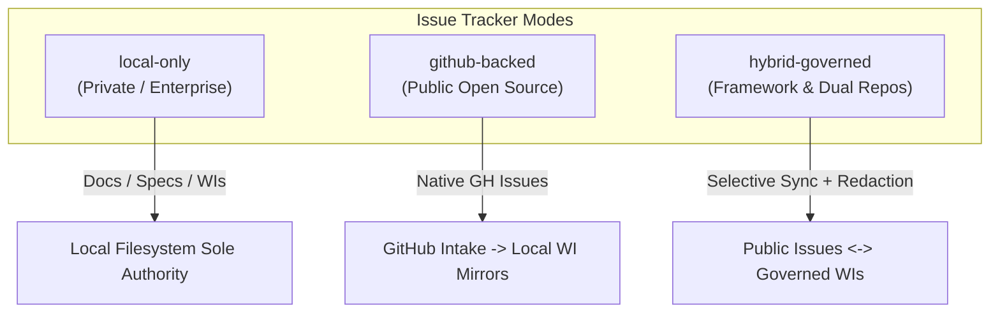
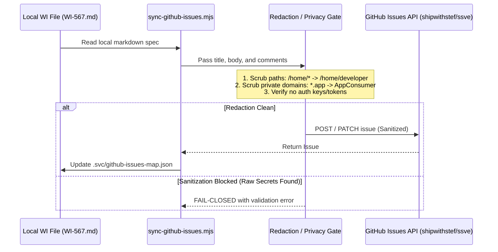

# SSVE Architecture Proposal: Unified Work Items (WIs) & GitHub Issues

> **Status:** Conceptual Architecture Proposal
> **Author:** Antigravity / Serious Serious Vibe Engineering
> **Target Scope:** SSVE Core Framework, Multi-Host Orchestration, and Consumer Repositories

---

## 1. Executive Summary & Core Motivation

Serious Serious Vibe Engineering (SSVE) is built on **local-first, deterministic, and progressive narrowing**.

Historically, SSVE invented the **Work Item (WI)** primitive (`docs/specs/work-items/WI-*.md`) to solve a critical constraint of agentic development:
1. **Local-First & Offline Resilience:** Agents must operate hermetically inside local Git worktrees without requiring network connectivity, external API rate limits, or proprietary platform locks.
2. **Strict Authority Guardrails:** Mutation authority (`hooks/codex/svc-codex-pretool-dispatcher.mjs`) is strictly bound to a local worktree and work item ID (`b.binding.wi`).
3. **Private IP & Stealth Protection:** Enterprise and stealth client projects (e.g. proprietary commercial applications) cannot risk leaking internal customer identities, financial schemas, or business strategy into public cloud trackers.

However, for **Open Source Frameworks and Public Community Repositories** (like [`shipwithstef/ssve`](https://github.com/shipwithstef/ssve)):
- Community developers, contributors, and users live on **GitHub Issues**.
- Bug reports, feature proposals, and community triage must be visible, searchable, and interactive in GitHub's native UI.
- Closing issues via standard commit trailers (`Fixes #123`) and release tags is standard open-source best practice.

**The Goal:** Bridge local-first deterministic WI execution with native GitHub Issues via a **configurable, pluggable, repo-level architecture** that offers zero friction, prevents data leakage, and preserves deterministic verification.

---

## 2. The 3 Configurable Operating Modes

We propose a project-level configuration defined in `.svc/config.json` (or governed by `~/.svc/project-policy.json`):

```json
{
  "$schema": "https://ssve.dev/schemas/project-config.schema.json",
  "issue_tracker": {
    "provider": "github",
    "mode": "hybrid",
    "prefix": "WI-FW",
    "redaction_filter": "strict-public",
    "auto_sync_on_stage": ["spec", "verify-promotion"],
    "close_trigger": "verify-promotion"
  }
}
```



---

### Mode A: `local-only` (Default for Private / Stealth Projects)
- **Target:** Commercial applications, stealth startups, internal enterprise mono-repos (e.g., private client projects).
- **Behavior:**
  - `docs/specs/work-items/WI-*.md` remains the sole, authoritative source of truth.
  - No network calls to GitHub Issues API.
  - Zero risk of customer PII, internal paths, or unreleased commercial features leaking outside the firewall.
  - Worktree authority binds locally to `WI-<STACK>-<NAME>-<NN>`.

---

### Mode B: `github-backed` (For Community / Public Open Source)
- **Target:** Public open-source libraries and utilities where all backlog items are public by default.
- **Behavior:**
  - **Intake:** Community members open native GitHub Issues using `.github/ISSUE_TEMPLATE/` (bug report, feature request).
  - **Adoption:** When an issue is approved, running `svc route-workflow --from-issue 123` or `grok --work-on #123` automatically creates a lightweight mirror:
    `docs/specs/work-items/WI-GH-123.md`.
  - **Authority Binding:** The framework treats `WI-GH-123` as the canonical work item identifier for worktrees (`feature/WI-GH-123-title`), controller leases, and commit trailers.
  - **Landing:** Merging the PR with `Fixes #123` automatically transitions and closes the issue on GitHub.

---

### Mode C: `hybrid-governed` (The Recommended Framework Standard)
- **Target:** Hybrid repositories such as `seriousvibecoding` / `ssve`, which contain public core framework code alongside specialized or client-originated modules.
- **Behavior:**
  - Internal technical debt, deep architecture spikes, and foundation work can start locally as `WI-FW-<NAME>-<NN>.md`.
  - External bugs and community feature proposals start as GitHub Issues.
  - **Bidirectional Sync Engine (`sync-github-issues.mjs`):**
    - High-level WIs can be published to GitHub with `--publish`.
    - GitHub Issues can be pulled down to local WIs with `--pull`.
  - **Strict Redaction Gate:** Before any payload is transmitted to GitHub API, a deterministic sanitizer strips:
    - User home paths (`/home/*/...`)
    - Client/app codenames matching private registry filters
    - Secret keys, auth headers, and session tokens

---

## 3. Bidirectional Lifecycle & State Mapping

The lifecycle maps 1:1 between SSVE Progressive Narrowing Gates and GitHub Issue states:

| SSVE Pipeline Gate | Local WI State | GitHub Issue Status / Labels | Action / Automation |
|---|---|---|---|
| **Intake / Triage** | `DRAFT` / `PROPOSED` | `status:triage`, `lane:<lane>` | Issue created via template or local draft written |
| **G1 (`write-spec`)** | `SPEC-APPROVED` | `status:ready`, `size:<S/M/L>` | ACs mapped to issue checklist |
| **G2–G4 (UX/UI/Tech)** | `BASELINED` | `status:in-progress`, assigned | Worktree created; controller lease bound |
| **G5 (`execute-changeset`)** | `IN-REVIEW` | `status:review`, PR linked | Candidate branch pushed; PR opened with `Resolves #<ID>` |
| **G6 (`land-changeset`)** | `PROMOTED` | `status:merged` | PR squash-merged into `main` |
| **G7 (`verify-promotion`)**| `VERIFIED` / `CLOSED` | **CLOSED** (`state_reason: completed`) | Release receipt verified; post-deploy observation confirmed |

---

## 4. Privacy & Redaction Architecture (The "Clean Room" Sync)

To prevent the exact issue encountered earlier (where internal client names and personal paths were inadvertently ported into public issues):



### Sanitization Rules:
1. **Filesystem Anonymization:** Every absolute path matching `/home/([^/]+)/` is normalized to `/home/developer/`.
2. **Domain/Project Scoping:** Private customer or commercial workspace names are replaced with generic archetypes (`AppConsumer`, `DownstreamService`).
3. **Fail-Closed Gate:** If high-entropy tokens or raw private keys are detected, the sync script refuses to upload and exits nonzero.

---

## 5. Implementation Roadmap for SSVE

### Phase 1: Repo-Level Configuration Schema (`v1.1.0`)
- Add `schemas/project-config.schema.json` defining `issue_tracker` options.
- Support `repo_mode` detection in `setup` and `onboard-repo`.

### Phase 2: Inbound Issue Intake Command (`route-workflow --issue <N>`)
- Allow an agent to run:
  ```bash
  svc route-workflow --from-issue 68
  ```
  This fetches GitHub Issue #68, extracts problem statement and labels, writes `docs/specs/work-items/WI-GH-68.md`, and creates the worktree `~/worktrees/ssve/feature-WI-GH-68`.

### Phase 3: Automated Closure on `verify-promotion`
- In `skills/verify-promotion/SKILL.md`, when G7 promotion is verified and recorded:
  - If `issue_tracker.close_trigger == "verify-promotion"`, automatically invoke `scripts/sync-github-issues.mjs --close-wi <WI>` to close the remote GitHub Issue with the landed release tag and commit link.

---

## 6. Recommendations for Existing 8 GitHub Issues on `ssve`

For the 8 open issues (#1–#7, #19) currently on [`shipwithstef/ssve`](https://github.com/shipwithstef/ssve):
1. **Evaluate Resolutions:** All 8 issues represent bugs and capabilities that were already fixed on `main` in `v1.0.0-rc.1` and `v1.0.0-rc.2`.
2. **Closure Action:**
   - Grok's active session (`task-7324`) is auditing their bodies and comments.
   - Once confirmed 100% clean of private info, we should close them referencing the exact commit / PR that resolved them (e.g. *"Resolved in SSVE v1.0.0-rc.2 via PR #65"*).
   - This cleans the open issue tracker to a clean **0 open issues** state for genuine community traffic.
