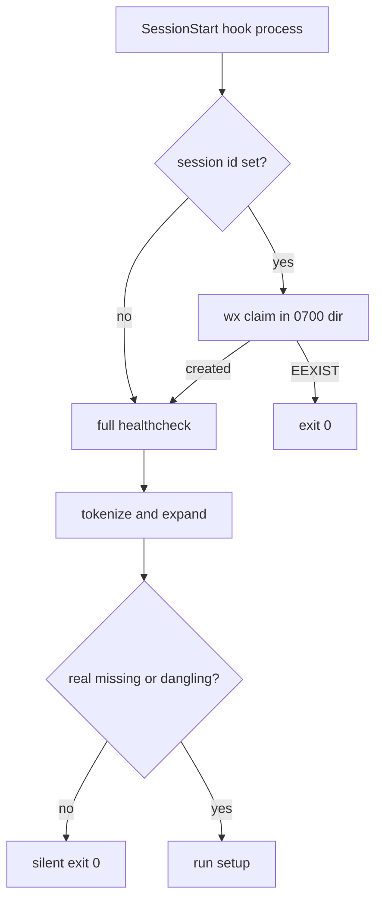

# System Contract Map: WI-542 / WI-543 Grok SessionStart hooks

**WI:** WI-542 (parser), WI-543 (Grok-native schema)
**Status:** EXECUTED
**Scope:** Host hook config (Grok/Kimi TOML, Claude JSON) → SessionStart healthcheck parser → optional setup self-heal; Grok wirer dual-schema emit. No product authentication surface.

This document identifies itself as a System Contract Map.

## Flow Diagram

```text
[Grok / Kimi / Claude SessionStart]
          |
          | GROK_SESSION_ID / peer session id
          v
[atomic wx claim in user-owned 0700 ~/.svc/sshc]
   | first claim                 | EEXIST
   |                             v
   |                      [exit 0 — skip full path]
   v
[tokenize hook commands]
   | expand only ~ / ~/ / $HOME/
   | existsSync only absolute *.mjs|js|sh
   v
[missing + dangling scan] --> [setup only if real holes]
          |
          v
[Grok wirer]
  read config fail-closed
  keep non-SVC hook tables verbatim
  drop SVC-owned tables
  emit nested [[hooks.<Event>]]
  immutable .pre-migration.bak (once)
  per-attempt .svc-wire.rollback
```



## Handoff Table

| From | To | Transport | Data Shape | Sender Storage | Receiver Storage | Next Reader | Failure Mode |
|---|---|---|---|---|---|---|---|
| Grok hook runner | healthcheck process | argv + env + stdin JSON | `GROK_SESSION_ID`, `HOME`, hook command | Grok session | Process env | `claimSameSession` | Missing session id always runs full path |
| healthcheck | 0700 claim dir | exclusive `wx` create | `svc-sshc-<host>-<sid>` file mode 0600 | `~/.svc/sshc` or `SVC_SSHC_DIR` | Same | Second same-session process | Shared `/tmp` claim is rejected; claim errors other than EEXIST fail open |
| Host config file | `findMissingHookScripts` | UTF-8 read | JSON hooks or TOML `command = "..."` | `~/.grok/config.toml` / `~/.kimi/config.toml` / Claude settings | Memory token list | existsSync after expand | Slash-seeking regex invented `/.grok/...` from `~/...` |
| Grok wirer | Grok config | atomic tmp+rename | Nested `[[hooks.<Event>]]` plus verbatim user tables | Worktree `scripts/wire-grok-hooks.mjs` | `~/.grok/config.toml` | `grok inspect --json` | Overwriting a single `.wi543.bak` destroyed the original flat backup |
| `grok inspect --json` | WI evidence | JSON file | `.hooks[].source.path` / `.hooks[].event` | Grok process | `docs/specs/verification/wi-542-grok-inspect-*.json` | review-gate / verify-promotion | Treating inspect `--help` as a probe |

## Origin / Storage Matrix

| Storage Layer | Origin / Owner | Written By | Readable By | Failure Mode |
|---|---|---|---|---|
| `~/.svc/sshc` (mode 0700, user-owned) | Current uid | healthcheck first claim | Same-uid SessionStart processes | World-writable `/tmp` stamp races and is shared |
| `~/.grok/config.toml` | User / Grok wirer | `wire-grok-hooks.mjs` | Grok inspect and healthcheck | Unreadable file must fail closed, not become empty |
| `config.toml.pre-migration.bak` | Wirer, created once | First mutating wire | Operator restore | Repeating copy onto `.wi543.bak` overwrote the original flat file |
| `config.toml.svc-wire.rollback` | Wirer, per attempt | Each wire before write | Failure restore | Using the immutable backup as the per-attempt rollback |
| Inspect JSON | Grok CLI | `grok inspect --json` | Review / verify-promotion | Untracked full dumps are not durable; tracked hook extracts live under `docs/specs/verification/` |
| Live `~/.kimi/config.toml` leftover `/tmp/fake` hooks | Prior test pollution | Not this WI | Kimi healthcheck | Out of scope; see WI-544 |

## External Platform Invariants

| Claim | Verification Source | Probe | Status |
|---|---|---|---|
| Grok observe hooks default to 5s unless timeout is set | `~/.grok/docs/user-guide/10-hooks.md` | Session log `timed out after 5000ms` on Claude-compat healthcheck | verified-source |
| `GROK_SESSION_ID` is injected on every hook | same user-guide Environment Variables table | `echo $GROK_SESSION_ID` in this session | verified-runtime |
| Grok loads nested `[[hooks.<Event>]]` from user config | `grok inspect --json` after wire | `source.path` contains `/.grok` | verified-runtime |
| Flat `[[hooks]]` was not loaded before the nested rewrite | inspect-before JSON | `grok_native_session_start == 0` | verified-runtime |
| Live `.wi543.bak` is not the original flat backup | sha256 of live files | both files `1afbca9d...` | verified-runtime |

## Falsification Probes

| Hypothesis | Confirmation Check | Falsification Check | Result | Evidence |
|---|---|---|---|---|
| Slash-seeking regex treats `~/...mjs` as missing | Old regex hits `/.grok/skills/hooks/foo.mjs` and existsSync is false | New tokenize+expand reports missing=[] on the same file | hypothesis-holds | `docs/specs/test-evidence/WI-542/old-new-path-probe-run.json` |
| Nested emit is what Grok loads | inspect-after has one healthcheck whose source.path is under `.grok` | inspect-before had zero `.grok` session_start sources | hypothesis-holds | `docs/specs/verification/wi-542-grok-inspect-before.json` / `-after.json` |
| Parallel same-session claims run the full path once | T8 counts exactly one dangling/self-heal line | Two no-session-id runs both produce the line | hypothesis-holds | `validate-session-start-self-heal.sh` T8 |

## Old Path / New Path Proof

| Same Input | Old Path Result | New Path Result | Conclusion | Evidence |
|---|---|---|---|---|
| TOML `command = "node ~/.grok/skills/hooks/foo.mjs"` with the file present | missing=`/.grok/skills/hooks/foo.mjs` (failing-state) | missing=[] (PASS) | parser migration proven | `docs/specs/test-evidence/WI-542/old-new-path-probe-run.json` |
| `grok inspect --json` session_start sources | 5 rows, all `.claude`, 0 `.grok` | 6 rows, 1 `.grok` healthcheck + 1 Claude healthcheck | native schema load proven; total count == 1 is not the bar | inspect before/after JSON |

## Iteration Escalation

If the same SessionStart-red / missing-tilde / Grok-native-origin hypothesis is still open on a **third** diagnosis or remediations pass, halt implementation and run `review-cross-model` before resuming. Do not start a fourth speculative parser or wirer rewrite.

## Honest backup note

On 2026-08-17 the first live wire copied `~/.grok/config.toml` to `~/.grok/config.toml.wi543.bak` at sha256 `5804dc0c7820d81a88dc37c0e4c9de96ea67926803fac170a88c9ecc513de124` (flat `[[hooks]]`). A later rewire overwrote that file. Current live config and `.wi543.bak` are both `1afbca9d798b3e3e0c8869da9759aa2c6e11c1199ff7b78c7a7b6dfe6f065fbc` (nested emit). That `.wi543.bak` is **not** the original pre-migration backup. The wirer now writes `.pre-migration.bak` once and `.svc-wire.rollback` per attempt.

## Out of scope

Live Kimi `/tmp/fake` leftover hook commands are not cleaned here. Follow-up: WI-544.
