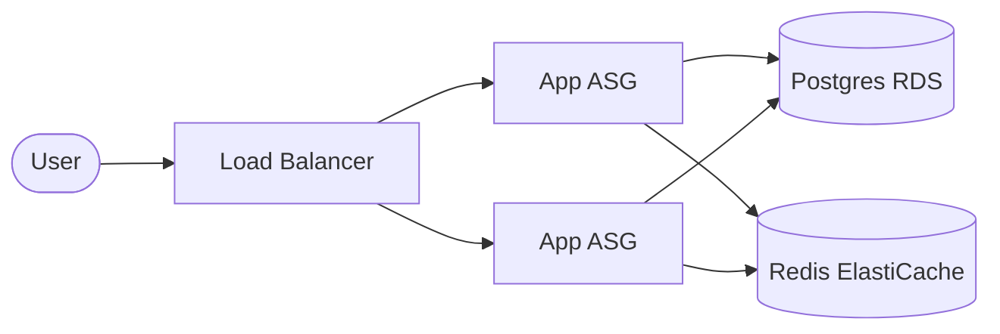

# Infra Topology Template

Source: `proposals/done/2026-04-30-infra-project-support.md` § 5 phase 3

Replaces UX screen flows for infra lanes. Output is the resource graph + trust boundaries that a downstream skill (`design-tech`, `plan-changeset`) consumes.

## Resource Graph (mermaid)

## Resource Inventory

| Resource | Type | Owner | Criticality | Blast-Radius Tier |
|---|---|---|---|---|
| `lb` | aws_lb | platform | tier-1 | SEV-1 if down |
| `app1`, `app2` | aws_autoscaling_group | platform | tier-1 | SEV-2 (one ASG) |
| `db` | aws_db_instance | platform | tier-1 | SEV-1 |
| `cache` | aws_elasticache_cluster | platform | tier-2 | SEV-3 |

## Trust Boundaries

| Boundary | Source | Destination | Auth | Notes |
|---|---|---|---|---|
| internet → vpc-public | user | lb | TLS | WAF in front |
| vpc-public → vpc-private | lb | app | sg-only | no public IPs |
| app → db | app | db | iam-auth | rotated daily |
| app → cache | app | cache | sg-only | redis AUTH disabled |

## Data-Flow

Sensitive-data classifications + boundary crossings.

## Failure-Domain Boundaries

AZ/region partitioning. Which resources can survive which failure?
