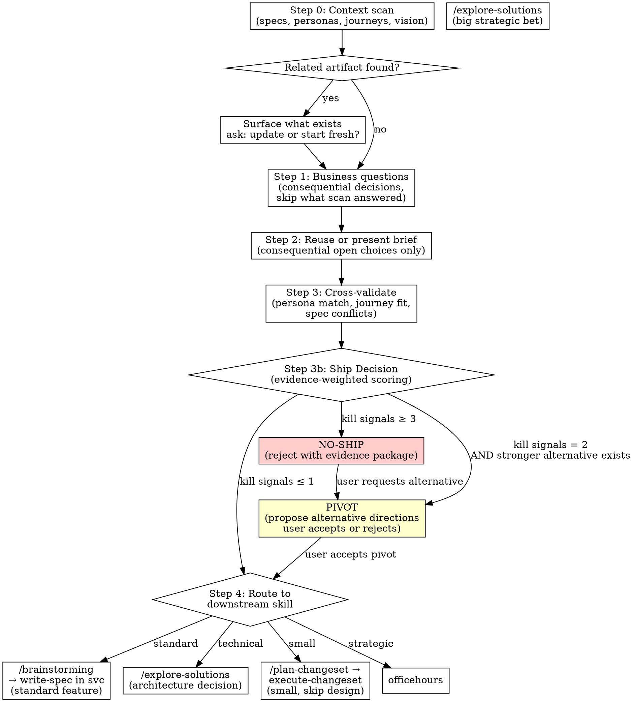

# Feature Discovery

## Overview

Turn a raw feature idea into a validated, cross-referenced business brief before any technical
design begins. The output is a Feature Ship Brief — a permanent product-layer document that
captures the strategic bet, user problem, success condition, and MVP hypothesis.

This skill does three things that jumping straight to design misses:
1. **Checks what already exists** — specs, personas, journeys that relate to this idea
2. **Validates the business case** — evidence-backed business dimensions and unresolved consequential choices
3. **Routes to the right next skill** — based on what the discovery learned

**Core principle:** Understand why before how. A feature that solves the wrong problem
perfectly is worse than no feature at all.

**Announce at start:** "I'm using validate-feature to validate this idea before we design anything."

## Product Questions — MANDATORY format

Ground the business case in current owner scope, persona/journey/spec evidence and actual relevant code. Follow `_shared/product-question-format.md` with `phase: validate-feature`. Reuse accepted decisions and task authorization; ask only unresolved consequential owner choices. Record real decisions in the existing companion or canonical decision artifact. No empty companion or numeric question floor is required. Unresolved consequential decisions block dependent work.

## Repository Mode Gate

Before Step 0, detect repository mode from `REPO_MODES.md` and state it.

- `bootstrap`: if personas/journeys/specs do not exist yet, produce an initialization brief
  and route to `write-vision` → `analyze-domain` → `build-personas` to scaffold first.
- `convert`: validate ideas against existing repo artifacts and map findings to current
  structure before proposing consolidation.

<HARD-GATE>
Before proposing implementation, ground the problem, intended user outcome and scope in the context scan and Feature Ship Brief. Reuse an existing accepted brief or clear founder instruction for an already-authorized bounded change. Cover relevant business dimensions from evidence; only unresolved consequential choices require owner input. Do not ignore supplied technical facts, repeat answered questions, or insist on new confirmation of existing authorization. Missing consequential evidence or conflicting scope blocks dependent work under the shared promotion predicate.
</HARD-GATE>

---

## Before Starting

Read (in order, only as needed for this run):
- `docs/specs/project-state.md` — current pipeline state, active feature, lane
- `~/.svc/builder-profile.md` — builder context, stack, prior decisions
- `docs/specs/domain-profile.md` — industry conventions, framework constraints
- existing feature specs at `docs/specs/features/*.md` — to detect duplicate intent before validation begins

Read **as needed**, not all 4 unconditionally. See `_shared/before-starting.md` for the canonical chain documentation.

---

## Process



---

### 0. Task Graph Setup — MANDATORY

Before any validation work, establish a task graph. This makes the FEATURE lane
trackable by the stop hook and persistent across sessions.

**WI file naming:** `.svc/lane-tasks-WI-###.json`. Each WI gets its own
file — parallel work items coexist without collision.

**Case (a) — JSON exists AND Task {T} already has `process_tasks`:**
Skip this section entirely. Confirm Task {T} is `in_progress`, hydrate if
needed (Claude Code: call `TaskCreate` for {T}.1–{T}.9 if not already hydrated),
and proceed to Step 0 below.

**Case (b) — JSON exists but Task {T} has no `process_tasks`:**
Embed the process_tasks array into Task {T}'s entry in the JSON file now,
then hydrate and proceed. Do NOT overwrite the file — add only to Task {T}'s entry.

**Case (c) — No JSON file exists (standalone validate-feature run):**
Initialize it now:

```bash
node scripts/task-graph.mjs init .svc/lane-tasks-<WI>.json --wi <WI-###> --lane feature
```

Then populate it using the template below while preserving the helper-generated
`created` timestamp.

In all cases, `{T}` is your lane task ID — `1` in a standalone run, `5` in a
full greenfield feature lane. Process task IDs are composite: `{T}.1` through
`{T}.9`. The `name` field uses `skill|phase` convention.

```json
{
  "wi": "<WI-###>",
  "lane": "feature",
  "created": "<helper-generated ISO 8601 wall-clock timestamp>",
  "flags": [],
  "tasks": [
    {
      "id": 1,
      "skill": "validate-feature",
      "subject": "validate-feature: market validation + ship decision for <WI>",
      "status": "in_progress",
      "blocked_by": [],
      "process_tasks": [
        { "id": "1.1", "name": "validate-feature|context-scan",        "status": "in_progress", "blocked_by": [],      "subject": "Scan project for existing artifacts: WI, spec, brief, journeys, ACs related to this idea" },
        { "id": "1.2", "name": "validate-feature|escape-check",        "status": "pending",     "blocked_by": ["1.1"], "subject": "[CONDITIONAL] P2 applicability: bootstrap missing context or bounded repair/consolidation with sufficient evidence; skip only non-applicable business work and route" },
        { "id": "1.3", "name": "validate-feature|market-check",        "status": "pending",     "blocked_by": ["1.2"], "subject": "Resolve applicable market uncertainty; reuse current evidence when sufficient" },
        { "id": "1.4", "name": "validate-feature|business-questions",  "status": "pending",     "blocked_by": ["1.3"], "subject": "Step 1: unresolved business decisions with user — problem, persona, evidence, alternatives" },
        { "id": "1.5", "name": "validate-feature|brief-present",       "status": "pending",     "blocked_by": ["1.4"], "subject": "Step 2: reuse or present brief; resolve only consequential open choices" },
        { "id": "1.6", "name": "validate-feature|cross-validate",      "status": "pending",     "blocked_by": ["1.5"], "subject": "Step 3: cross-validate against existing specs, journeys, ACs, market position" },
        { "id": "1.7", "name": "validate-feature|ship-decision",       "status": "pending",     "blocked_by": ["1.6"], "subject": "Step 3b: evaluate K1–K7 kill signals → ship / no-ship / pivot verdict" },
        { "id": "1.8", "name": "validate-feature|route",               "status": "pending",     "blocked_by": ["1.7"], "subject": "Step 4: write WI file + route to write-spec or escalate to strategic/technical skill" },
        { "id": "1.9", "name": "validate-feature|finalize",            "status": "pending",     "blocked_by": ["1.8"], "subject": "Update lane-tasks.json: mark process_tasks complete, mark Task 1 completed" }
      ]
    },
    {
      "id": 2, "skill": "write-spec",
      "subject": "write-spec: feature spec for <WI>",
      "status": "pending",
      "blocked_by": [1]
    }
  ]
}
```

When Task `{T}` reaches a new top-level status, use:

```bash
node scripts/task-graph.mjs set-status .svc/lane-tasks-<WI>.json {T} completed
```

This keeps `completed_at` tied to real wall-clock time instead of hand-written placeholders.

**Task {T}.2 `validate-feature|escape-check` is dynamic (conditional skip).**
After completing {T}.1 (context-scan), evaluate the HARD-GATE condition:
- If the project is standalone/greenfield with no existing product → set tasks
  {T}.3 through {T}.7 to `"status": "skipped"` in the JSON file AND in the
  Claude task system. Proceed directly to {T}.8 (route).
- If the project has existing context → evaluate the applicability below; retain relevant cross-validation and routing, and skip only work whose evidence is already sufficient.

**Market-check applicability:** Evaluate each market question with `researchDecision(question)` from `scripts/lib/research-decision.mjs`. External research runs only for an explicit request, necessary freshness with a stated reason, or a consequential externally answerable question below 7/10. Missing ordinary confidence is analysis. Sufficient verified current cited evidence can resolve the question; a numerical score alone is not evidence. Tool availability does not itself justify research. For an already-authorized bounded change, reuse accepted scope and current AC/persona/spec/code evidence; do not create a new market-validation cycle or rescore its business case without new contradictory evidence.

For concept fragmentation, an existing pipeline break, or a missing journey describing existing functionality, P2 reuses the established expected behavior and skips P3–P5 when no new consequential business uncertainty exists. Route to diagnose-bug, plan-changeset, write-journeys or audit-ac according to the actual gap; retain relevant dependency and spec/code conflict checks.

**Apply the context-scan result to the existing graph:** P2 records whether P3–P5 apply and why. For a bounded authorized change with sufficient current evidence, mark non-applicable process tasks using the existing conditional-skip convention and continue relevant cross-validation and routing. Do not fabricate executed phase receipts or new brief artifacts. A new idea, missing consequential evidence, or a material conflict still requires the applicable business work; authorization alone is not evidence of demand. P6 accepts the existing brief or canonical owner scope as its routing input.

---

**How to hydrate and follow the task graph — by platform:**

The JSON file is written first. Then each platform hydrates it into its native
task system and follows from there. The flow is always:
**file → hydrate → follow → update file on each completion.**

**Claude Code (has TaskCreate):**

1. **Hydrate:** Read the JSON file. Call `TaskCreate` for every lane task and
   every process task ({T}.1–{T}.9). Name format: `[{id}] {name}` — e.g.
   `[1.1] validate-feature|context-scan`. Set {T}.1 → `in_progress`; all others → `pending`.
2. **Follow:** Work through the hydrated task list in order.
3. **On each completion:** Update the process task status in the JSON file AND
   call `TaskUpdate`. File first, then task system.

```
ToolSearch("select:TaskCreate") →
  Create lane tasks (use subject from JSON)
  Then create process tasks {T}.1–{T}.9 (name: "[{id}] {name}", subject from process_tasks array)
  Set {T}.1 → in_progress; all others → pending
```

**After auto-compact (context reset in Claude Code):**

```
1. Read .svc/lane-tasks-<WI>.json
2. Find Task {T}'s process_tasks array
3. Re-create all tasks via TaskCreate (completed/skipped ones as-is, first incomplete as in_progress)
4. Resume from the first incomplete process task
```

Never re-run completed process tasks. The file tells you where you left off.

**Codex, Gemini, and other platforms (no TaskCreate):**

1. Read the JSON file directly — it IS your task list.
2. Follow the process_tasks array in order. The `subject` field is your instruction.
3. On each completion: Update `process_tasks[*].status` in the file.
4. After context reset: Re-read the JSON, find first incomplete task, continue.

**Stop hook enforcement (all platforms):** Task {T} cannot be marked `completed`
until all 9 process_tasks have `status: "completed"` or `"skipped"` (skipped
is valid for {T}.3–{T}.7 on the escape-hatch path).

---

**The two-level picture:**

```
LANE TASKS (lane-tasks-<WI>.json, persisted, all platforms)
  {T}. validate-feature           ← process_tasks: {T}.1–{T}.9 (embedded in JSON)
  {T+1}. write-spec               ← process_tasks: added by write-spec when it runs
  {T+2}. design-tech              ← lane-level only
  ...

PROCESS TASKS (embedded in lane task {T}, UI mirror in Claude Code)
  {T}.1  validate-feature|context-scan       ← Step 0 (always first)
  {T}.2  validate-feature|escape-check       ← HARD-GATE (dynamic: may skip {T}.3–{T}.7)
  {T}.3  validate-feature|market-check       ← applicable market evidence gaps only
  {T}.4  validate-feature|business-questions ← Step 1 (relevant dimensions, grounded in real data)
  {T}.5  validate-feature|brief-present      ← Step 2 (reuse accepted scope; resolve open choices)
  {T}.6  validate-feature|cross-validate     ← Step 3 (spec/journey alignment)
  {T}.7  validate-feature|ship-decision      ← Step 3b (K1–K7 kill signals)
  {T}.8  validate-feature|route              ← Step 4 (write WI + route)
  {T}.9  validate-feature|finalize           ← update JSON, mark lane task done
```

**Process task → skill step mapping:**

| Process Task | Skill Step | Notes |
|---|---|---|
| {T}.1 context-scan | Step 0 | Full context scan before anything |
| {T}.2 escape-check | HARD-GATE | Dynamic: sets {T}.3–{T}.7 to skipped if fires |
| {T}.3 market-check | Step 1 (Q3/Q4 proxy) | Relevant existing evidence or targeted research for an open market question |
| {T}.4 business-questions | Step 1 (full) | Relevant business dimensions and unresolved choices, grounded in {T}.3 data |
| {T}.5 brief-present | Step 2 | Accepted scope reused; unresolved consequential choices resolved |
| {T}.6 cross-validate | Step 3 | Alignment with existing specs/journeys |
| {T}.7 ship-decision | Step 3b | K1–K7 kill signals → verdict |
| {T}.8 route | Step 4 | Write WI or escalate |
| {T}.9 finalize | (meta) | JSON update + lane task completion |

---

## Step 0: Context Scan

Before asking a single question, scan the project for existing artifacts related to the idea.

### What to check (in this order — high-level first, detail only when needed)

**Tier 1: Product-level truth (always check these first)**

These tell you whether the feature idea already has a home in the product, which
users it affects, and how it connects to existing flows. Start here — most feature
questions are answered at this level without needing to read code.

```
1. Journeys — glob docs/specs/journeys/*.feature.md
   → Does an existing journey touch this area? Which personas does it serve?
   → Does the journey's Background assume data that relates to this feature?
   → Is there a supply-side gap — a journey that consumes this concept but
     no journey where a producer creates it?
   Read the journey fully, not just the title. The Journey Analysis section
   (Logical Issues, Missing Transitions, Product Gaps) often directly answers
   whether this feature idea has already been identified as a gap.

2. Personas — glob docs/specs/personas/P*.md
   → Which persona(s) would this serve? Read their pains, goals, patience budget.
   → Does any persona's "Skill Implications" section mention this area?
   → Is there a persona gap — a user type that exists in the product but has
     no persona file? (e.g., the product has admin features but no admin persona)

3. Vision / CLAUDE.md — read docs/specs/vision.md or the project CLAUDE.md
   → Does this align with the product's stated direction?

4. Domain profile — read docs/specs/domain-profile.md
   → What industry patterns apply? What pitfalls exist in this space?
   → Does the feature idea align with domain conventions or fight them?

5. Competitor analysis — read docs/specs/analyze-competitors.md
   → Has a competitor already built this? (feeds kill signal K3)
   → What whitespace exists? Does the feature exploit it?
```

**SDKG Industry Grounding gate (per WI-140 + WI-142):** Every feature spec moving to BASELINED MUST include an `## Industry Grounding` section, regardless of feature type or keyword match. Pre-WI-142 this gate only fired for specs whose ACs matched core-mechanic keywords (`earn|redeem|verify|enroll|loyalty|points|reward`); WI-142 removed that keyword trigger because it left 90% of feature work without competitive grounding. The only exemptions are explicit `landscape_inapplicable_reason` frontmatter, OR a Type:Enabler/Integration spec with UX/UI pillar marked `[N/A — justified]` (no customer-facing flow to ground).

The structured-gate-engine reads `docs/specs/analyze-competitors.data.json`, branches on `landscape_state` (populated → BLOCK BASELINED unless aligned or has compensating-control; nascent → WARN + require `thin_evidence_acknowledged: true`; none-found → require First-Mover Risk Checklist; inapplicable → SKIP + log justification).

```bash
node scripts/lib/structured-gate-engine.mjs \
  --schema=references/schemas/competitor-analysis.schema.json \
  --data=docs/specs/analyze-competitors.data.json \
  --config=scripts/gates/competitive.mjs \
  --artifact=docs/specs/features/<feature>.md
# Exit 0 = pass/warn/skip, 1 = block/halt. Section template:
# references/templates/industry-grounding.md (four parts: industry / us / why differ / reversibility)
```

If verdict=HALT (data missing or stale), invoke `/analyze-competitors` first — DO NOT silently pass. If verdict=BLOCK, the spec cannot reach BASELINED until either (a) spec aligns with at least one competitor pattern, OR (b) `## Compensating Control` section is present with all 4 fields (per CC-01..CC-03). See `references/templates/compensating-control.md`. The gate engine reads from a structured data file at gate-time and NEVER triggers web research — the `validate-no-web-fetch-in-gate.sh` validator locks that contract in (per WI-142).

**Tier 2: Feature-level detail (only when Tier 1 points you here)**

Drill into a specific feature spec only when journeys or personas reference it,
or when you need to understand the exact ACs, entity schema, or user stories for
the domain this feature idea touches.

```
4. Feature specs — glob docs/specs/features/ (or project equivalent)
   → Only read specs that Tier 1 pointed you to (e.g., the journey covers
     "flash deals" so read the flash deals spec for AC detail)
   → Check the AC coverage table — are there gaps the feature idea would fill?
   → Check Spec-Code Sync Status — are there known drifts?

5. Recent work — git log --oneline -20
   → Is someone already building something related?
```

**Tier 3: Codebase reality (only when Tier 1+2 leave questions unanswered)**

Read actual source code when you need to verify whether something that's specced
actually exists, whether a UI component works as described, or whether two things
that sound different are actually the same entity.

```
6. Codebase reality — grep/read the actual source code
   → Does the feature already exist in code? Is it partially built?
   → Who calls it? What entity does it use? What security/validation does it go through?
   → Is there existing backend infrastructure the feature can leverage?
   → Are there two components creating the same entity under different names?
```

**Why this order matters:** Journeys and personas encode product decisions —
who the users are, what flows matter, what gaps have been identified. Feature
specs encode detailed requirements. Code encodes what actually got built.
Starting with code leads to "what exists?" thinking. Starting with journeys
leads to "what should exist for each user?" thinking — which catches gaps
like a consumer journey with no producer counterpart.

**The codebase is the ground truth.** Specs, journeys, and personas describe intent. The
code describes reality. When investigating whether a feature idea is new, partially built,
or a duplicate, ALWAYS read the relevant source files. Grep for entity names, function calls,
component imports. The answer to "who has this problem?" and "what do they do today?" is
often sitting in the code — don't ask the user questions the codebase can answer.

For example: if the user asks about a "last hour offer" feature, don't ask "does an owner
flow for this exist?" — grep for the component, read it, check what entity it creates,
check if it goes through validation, check what other pages create the same entity. Then
present findings: "This component exists at X, it creates Y entity, but it bypasses Z
validation that the existing consumer-side page relies on."

### Concept deduplication and industry pattern matching

When the context scan finds code related to the feature idea, check for concept
fragmentation — the same underlying entity or user goal served by multiple components
under different names. Two components that create the same entity ARE the same feature,
no matter what they're called.

**Identify the industry pattern.** Most product features map to well-known patterns.
Name the pattern and check whether the product covers all sides:

| Pattern | Producer | Consumer | System |
|---------|----------|----------|--------|
| Flash deals / time-limited offers | Seller creates (validation, plan gating) | Buyer browses, claims (limits, confirmation) | Notifications, expiry cleanup |
| Referral programs | Referrer shares (tracking) | Referee signs up (attribution) | Double-sided rewards, fraud |
| Booking / reservations | Provider sets availability | Customer books (confirmation) | No-show, waitlist |
| Reviews / ratings | Customer writes (purchase gate) | Owner responds (moderation) | Aggregate scoring |
| Loyalty / points | System awards on purchase | Customer redeems (balance check) | Tier progression, expiry |
| Content publishing | Creator publishes (draft→live) | Audience discovers (feed, search) | Moderation, analytics |

When you identify the pattern, present the diagnosis — don't ask the user to tell you:
"This is a flash deals pattern. The consumer side (browse + claim) is fully built. The
producer side (create deal) exists as a broken shortcut that bypasses your security
pipeline. The system side (notifications) is built but unreachable because the producer
path doesn't go through it. This isn't a new feature — it's a pipeline fix."

**If two names exist for the same concept**, recommend consolidation: "The codebase calls
this 'Flash Offer' (entity + consumer page) and 'Last Hour Offer' (producer button).
These are the same thing — a flash deal. Pick one name. The entity name usually wins."

This analysis replaces business questions Q1-Q3 when the codebase already contains the
answer. Don't interrogate the user about problems the code reveals.

### What to do with findings

**If a feature spec already exists** for this exact idea:
Surface it. "There's already a spec for this: `docs/specs/features/feature-matching.md`. Want to
update it, or is your idea different from what's described there?"

**If a persona match is found:**
Name it. "This sounds like it serves P1 (Collaborator) — their top pain is finding reliable
partners. Their challenges doc mentions [specific pain]." Use this to inform Q1 (who) and Q2
(how bad) — don't re-ask what the persona already answers.

**If a journey overlaps:**
Flag it. "J02 (daily matching loop) covers the flow you're describing. This feature would
extend/modify that journey at the [specific scenario] step."

**If vision alignment is unclear:**
Be honest. "The vision doc focuses on trust-based matchmaking. This idea is about [X] — how
does it connect to the core mission?"

**If nothing exists:**
Say so. "No existing specs, personas, or journeys relate to this idea. Starting fresh."

---

## Step 1: Business Questions

This step behaves differently based on invocation mode.

### Guided Mode (standalone or `--progressive` without `--auto-approve`)

Ask only unresolved consequential owner choices. Group independent questions when useful outside the signed `decide` flow; preserve that flow when applicable.

**Scale to what the user already said AND what the codebase reveals** — if the context scan,
the codebase grep, or the user's initial message already answered a question, skip it.
Don't ask the user questions the code can answer.

For each question: **always present a recommended answer** based on the context scan, codebase
analysis, and domain knowledge. The user can accept the recommendation, customize it, or
override it entirely.

Format:
```
Q1: Who has this problem?
RECOMMENDATION: Based on P1's profile, this serves self-directed learners who [pain].
→ Accept / Customize / Override?
```

If ordinary confidence is missing, analyze current cited evidence — a missing score is not a research trigger:
```
Q4: What's the bet?
I'm not certain about the strategic thesis here. Current evidence: [source / basis / freshness].
Invoke research only if researchDecision(question) returns external_research_required.
RECOMMENDATION: [finding-informed answer]
→ Accept / Customize / Override?
```

### Auto Mode (`--progressive --auto-approve`)

Answer questions yourself using this priority:

1. **Current owner intent plus spec/code evidence** — use the context scan; expose conflicts rather than treating existing code as approval
2. **Persona/journey data** — what existing artifacts say about this user/problem
3. **Domain conventions** — what the industry pattern suggests (from training data)
4. **External research** — only if `researchDecision(question)` returns `external_research_required`; otherwise continue as analysis. Missing ordinary confidence is analysis. Sufficient verified current cited evidence can resolve the question.

For each question, log the answer and its source in the brief:
```
Q1: Who has this problem?
→ P1 (Self-Directed Learner) — source: persona match from context scan
Q4: What's the bet?
→ [answer] — source: research finding (docs/specs/research-log.md, 2026-04-04)
```

Auto mode covers relevant business dimensions from evidence without manufacturing question entries. Record unresolved consequential choices; do not assume a consequential owner answer outside the existing signed delegation. The brief must substantiate scope and success criteria.

### Business dimensions (evidence coverage, not a question quota)

| # | Question | What you're learning |
|---|----------|----------------------|
| 1 | **Who has this problem?** Which specific user, in what situation? | Problem owner |
| 2 | **How bad is it?** What do they do today instead? What's the cost of not solving it? | Pain severity |
| 3 | **Why now?** What changed that makes this the right moment? | Timing argument |
| 4 | **What's the bet?** What's the non-obvious insight — the thing that's true that most people haven't noticed? Cross-reference against competitor analysis — is this thesis already disproven by competitor outcomes? | Strategic thesis |
| 5 | **What does winning look like?** One metric. If this works, what moves? | Success condition |
| 6 | **What's the kill condition?** What result in 30-60 days tells you this was wrong? | Failure signal |
| 7 | **What's the MVP?** Smallest thing that proves or disproves the bet. User behavior, not features. | Validation scope |
| 8 | **What are you explicitly NOT building?** | Scope boundary |

### When to invoke research

Per question, call `researchDecision(question)` from `scripts/lib/research-decision.mjs`. Insert `research` only when it returns `external_research_required`: explicit user request, necessary freshness (stated reason, externally resolvable, insufficient current cited evidence), or a consequential externally answerable question with confidence below 7. Bind `requesting_decision_id` and `requesting_task_id`; reuse a matching existing task on the same decision ID; keep the requester blocked while unresolved; a changed claim invalidates only that claim's old proof.

Missing ordinary confidence is analysis. Repository reading, knowledge recall, and codebase answers are analysis. A numerical score alone is not evidence. Sufficient verified current cited evidence can resolve ordinary questions. Do not fabricate a completed `research` receipt when only local analysis ran.

### Live market signals (recommended: last30days)

If `/last30days` is available (installed via
[mvanhorn/last30days-skill](https://github.com/mvanhorn/last30days-skill)),
use it only when an unresolved consequential market question needs current external evidence. Existing adequate evidence for a bounded change does not trigger a fresh search.
This replaces LLM training data guesswork with actual engagement signals from
Reddit, HN, X, YouTube, and Polymarket.

**When to invoke last30days:**

| Question | What to search | What you get |
|----------|---------------|-------------|
| Q1: Who has this problem? | The problem statement | Real people discussing it — subreddits, thread titles, upvote counts |
| Q2: How bad is it? | Pain points, complaints, workarounds | Engagement velocity — are people angry (high upvotes, many comments) or mildly annoyed? |
| Q3: Why now? | The domain/topic | Trending or flat? 30-day spike or steady background noise? |
| Q4: What's the bet? | The non-obvious insight | Cross-platform convergence — does the signal appear across Reddit AND HN AND X, or just one? |
| Q6: What's the kill condition? | Competitor names + feature | Did someone just ship this? Polymarket/HN signals |

**How to invoke:**

```
/last30days "<problem-statement> <domain> pain points complaints"
```

Read the output. Extract:
- **Signal strength** — high engagement (100+ upvotes, 50+ comments) = real pain
- **Recency** — posts from the last 7 days = actively trending
- **Cross-platform** — same topic on Reddit AND HN = genuine demand, not echo chamber
- **Competitor mentions** — someone already solving this = validate or kill

Include the findings in the brief with citation:

```
Q3: Why now?
→ Trending on HN (3 posts, 450+ points in last 2 weeks) and r/programming
  (8 threads, 1200+ upvotes). Signal is cross-platform and accelerating.
  — source: last30days research (2026-04-05)
```

**If last30days is not available:** Stay on analysis unless `researchDecision(question)` returns `external_research_required`. Then invoke `research` for that question only. The business questions still work from current cited evidence; a missing score is not a research trigger.

### Informed by Step 0

When the context scan found relevant artifacts, weave them into recommendations:

- **Persona found:** "Based on P1's profile, they struggle with [pain]. Is that the person you mean, or someone else?"
- **Journey found:** "J02 already has users doing [thing] at the [step]. Is your MVP extending that, or something separate?"
- **Spec found:** "The matching spec mentions [related concept]. Is your bet that the current approach is wrong, or that it needs an addition?"

### Gaps

In guided mode: if the user can't answer a question, mark it as a gap. "Gap: user couldn't articulate a kill condition — worth defining before committing engineering time." Honest gaps > invented answers.

In auto mode: if research can't resolve a question, mark it as a gap with the research finding attached. Don't invent answers to fill gaps.

---

## Step 2: Present or Reuse the Brief

Reuse an accepted brief or bounded owner scope when it already covers the relevant outcome and acceptance criteria. For a new or materially changed brief, present the substantive sections together; ask only about unresolved consequential choices. Do not request section-by-section confirmation. `human_checkpoint: true` applies to those unresolved choices, not to reaffirming existing authorization. The following sections are evidence dimensions, not mandatory questions or a requirement to expand a bounded change into a new strategic bet.

1. **The Bet** — strategic thesis in 2-3 sentences
2. **Who / Problem** — user + pain, specific and concrete
3. **Why Now** — the timing argument
4. **Working Backwards** — one-paragraph press release as if it shipped and worked
5. **Success Metric** — the one number
6. **Kill Condition** — what failure looks like
7. **MVP** — what you're building first, in user-behavior language
8. **Explicit Non-Scope** — what's out

Use the template at `feature-ship-brief-template.md` for the final document format.

---

## Step 3: Cross-Validation

Cross-reference the current brief or accepted bounded scope against the project's relevant existing artifacts and actual code. Reuse current evidence; expose new conflicts without reopening settled decisions.
Report findings honestly — this is the skill's unique value over jumping to design.

### Persona validation

| Check | Action |
|-------|--------|
| Brief's "Who" matches an existing persona | Link it: "Serves P1 (Collaborator)" |
| Brief's "Who" is a new user type not in personas | Flag: "This introduces a new user type — run /build-personas to create P7 before journey work" |
| Brief's "Who" contradicts a persona's stated needs | Warn: "P2 (Visionary) explicitly wants [X], but this brief assumes they want [Y]" |

### Journey validation

| Check | Action |
|-------|--------|
| MVP implies a new user flow | Note: "The MVP flow doesn't fit any existing journey — /write-journeys will need to create a new one" |
| MVP extends an existing journey | Note: "This extends J02 at the [step] — write-journeys should add scenarios" |
| MVP conflicts with an existing journey | Warn: "J01 assumes [X] at step 3, but this feature changes that behavior" |

### Spec validation

| Check | Action |
|-------|--------|
| Feature touches an existing spec's domain | Note: "The matching spec will need updating if this ships" |
| Feature conflicts with existing spec behavior | Warn: "The trust spec says [X], but this brief proposes [Y] — resolve before design" |
| No related specs | Note: "Clean domain — no spec conflicts" |

### Vision alignment

| Check | Action |
|-------|--------|
| Clearly aligned | Note: "Directly supports [vision goal]" |
| Tangentially related | Note: "Supports vision indirectly through [connection]" |
| Misaligned | Warn: "This doesn't connect to the stated vision. That's not necessarily wrong — the vision may need updating — but be explicit about it" |

---

## Step 3b: Ship Decision

After cross-validation, score the feature against kill signals. This is the reject/pivot gate
— the only place in the pipeline that can say "don't build this" with structured evidence.

### Kill Signals

Evaluate each signal. A signal fires when the evidence supports it.

| # | Kill Signal | Source | Fires when |
|---|------------|--------|------------|
| K1 | No demand evidence | Q1 + Q2 + last30days | No one is paying, expanding usage, or visibly suffering. Waitlist signups and "interesting" feedback don't count. |
| K2 | No status quo pain | Q2 + context scan | Users aren't hacking around the problem. If no workaround exists, the pain isn't acute enough to drive adoption. |
| K3 | Competitor shipped it | Q3 + last30days + analyze-competitors | A well-funded competitor launched this exact thing in the last 90 days and it's gaining traction. Building a me-too won't win. |
| K4 | Vision misalignment | Cross-validation | The feature contradicts the product's stated direction and the vision shouldn't change to accommodate it. |
| K5 | No kill condition | Q6 | The user cannot articulate what failure looks like. If you can't define failure, you can't recognize it, and the feature will zombie-walk forever. |
| K6 | MVP is actually a platform | Q7 + Q4 | The "smallest version" requires 3+ months of work or multiple integrated systems. The wedge isn't narrow enough. |
| K7 | Existing solution in codebase | Context scan | The feature already exists under a different name, or a minor fix to existing code solves the same problem. **Coverage gate (mandatory):** Before firing K7, enumerate the user's described problem surface (e.g., "all sidebar destinations", "every customer mobile page", "every checkout step") and compare against the existing solution's actual scope (config list length, route table, classification array, etc.). K7 fires ONLY when the existing solution covers ≥95% of the described surface. If the existing component covers a strict subset (e.g., 3 of 16 sidebar destinations classified as ROOT_PAGES while the user described inconsistency across all peers), K7 does NOT fire — the user's complaint is real and partial-coverage is the underlying bug. Route to a bugfix that extends coverage, do NOT exit via the escape hatch. Source: example-marketplace WI-185 misroute, 2026-05-08. |

### Builder History Weighting

If a builder profile exists (`~/.svc/builder-profile.md`), adjust kill signal
sensitivity based on past project outcomes and builder patterns:

| Builder pattern | Kill signal adjustment |
|---|---|
| 2+ past projects died from no distribution | K1 (no demand) fires at LOWER threshold — require stronger evidence of demand before shipping. "Interesting idea" is not enough for this builder. |
| Past projects consistently over-scoped | K6 (MVP is a platform) fires at LOWER threshold — if this builder's "small" is historically large, be more aggressive about scope. |
| Builder has no marketing skills AND no social presence | K1 weight doubles — without distribution capability, even validated demand doesn't mean THIS builder can capture it. Recommend marketplace/SEO plays instead. |
| Builder abandoned projects at month 3+ | K6 should consider builder timeline, not just technical scope. A 3-month project for someone who quits at month 3 is a kill signal. |
| Builder has shipped successfully before | All signals at normal threshold — proven ability to execute means standard gates are sufficient. |
| Builder has relevant failed project | Check if THIS feature is the same idea repackaged. If the same concept failed before and nothing changed (no new skills, tools, or market shift), that's evidence for K1 or K3. |

### Scoring

Count the kill signals that fire. Each must include the specific evidence that triggered it.

### Decision

| Kill signals | Decision | Action |
|---|---|---|
| 0-1 | **SHIP** | Proceed to Step 4 (route to downstream skill) |
| 2, AND a stronger alternative exists | **PIVOT** | Present the alternative direction with evidence (see Pivot Protocol below) |
| 2, no clear alternative | **SHIP WITH WARNINGS** | Proceed but attach kill signals as risk flags to the brief |
| 2+, only K1/K6 firing AND blocked by Builder-Profile timing constraint (e.g., `[zero-to-revenue-gap]`, "no distribution yet", "pre-first-customer") | **DEFER (Milestone: `<condition>`)** | Shelf the feature without killing it. Feature is conceptually valid; only timing is wrong. See DEFER Protocol below. |
| 3+ (any mix) | **NO-SHIP** | Reject the feature. Present the full evidence package. Offer pivot. |

**NO-SHIP vs DEFER — which one applies?**

| Situation | Decision |
|---|---|
| K3 (competitor shipped), K4 (vision misalignment), K5 (no kill condition), K7 (already exists) fire | NO-SHIP — these are structural/strategic flaws that don't resolve by waiting. |
| K1 (no demand) fires because no users exist YET at this builder stage (pre-launch, pre-first-customer), AND the feature is for post-PMF scale | DEFER until the stage milestone is hit (e.g., "first paying customer", "100 active users", "post-distribution-channel-proven"). |
| K6 (MVP is a platform) fires because the feature is correctly-scoped but exceeds current time/capital budget | DEFER until the resource milestone is hit (e.g., "after Stage 1 revenue lands", "after co-founder joins"). |
| Any mix of K2/K3/K4/K5/K7 fires | NO-SHIP — DEFER is not an escape hatch for features with inherent flaws. |

**Core distinction:** NO-SHIP says "this feature is wrong." DEFER says "this feature is right, the timing isn't." If you cannot name a concrete milestone that would flip the kill signal, the decision is NO-SHIP, not DEFER.

### Decision Logging

After the ship decision is made, log it. The `run_id` comes from the active task graph (`.svc/lane-tasks-<WI>.json` → `wi` field). The `phase` comes from this task's `id` in the task graph.

```bash
# SHIP/NO-SHIP decision (mandatory — this is the highest-stakes decision in the pipeline)
node scripts/pipeline-log.mjs append \
  --path .svc/pipeline-decisions.jsonl \
  --run-id "<WI-ID>" \
  --skill validate-feature \
  --phase "<task-id>" \
  --type gate-result \
  --decision "<SHIP|NO-SHIP|PIVOT|SHIP WITH WARNINGS|DEFER>: <feature name>[ (Until: <milestone>) for DEFER]" \
  --reasoning "Kill signals: <N>/7. Top evidence: <1-2 sentence summary of strongest signal>" \
  --decided-by P0 \
  --evidence "<list kill signal names that fired, or 'none'>" \
  --overrideable true
```

In auto mode, also log each kill signal assessment as a separate `mechanical` entry so the full reasoning is reconstructable.

### NO-SHIP Evidence Package

When the decision is NO-SHIP, produce a structured rejection — not a vague "maybe reconsider."

```markdown
## Ship Decision: NO-SHIP

### Kill Signals (N of 7 fired)

#### K1: No demand evidence — FIRED
**Evidence:** [specific findings — search results, engagement data, research output]
**What would change this:** [what evidence would flip this signal — e.g., "3 paying customers
or 100+ upvote thread describing this exact pain"]

#### K3: Competitor shipped it — FIRED
**Evidence:** [competitor name, launch date, traction signals]
**What would change this:** [e.g., "their implementation misses X, which is the actual pain"]

#### K6: MVP is a platform — FIRED
**Evidence:** [why the smallest version still requires N systems]
**What would change this:** [e.g., "scope to just the CSV import, drop the dashboard"]

### Recommendation
Do not build [feature name]. The evidence does not support it.

### If You Disagree
Override this decision by providing counter-evidence for at least N-1 kill signals.
The brief will be updated and re-scored.
```

**In auto mode:** NO-SHIP always stops the pipeline and presents findings to the user.
This is never a silent decision — killing a feature is always a User-class decision.

**In interactive mode:** Present the evidence package, explain the reasoning, offer the
pivot if one exists. The user can override with counter-evidence.

### DEFER Protocol

When the decision is DEFER, the feature is conceptually valid but timing-blocked. Produce a structured shelf-note, not a rejection. A DEFER decision MUST name:

1. **The blocking kill signal(s)** — which K1/K6 fired and why
2. **The Builder-Profile constraint** — which specific profile entry (e.g., `[zero-to-revenue-gap]`, "no audience yet") caused the timing conflict
3. **The unblocking milestone** — a CONCRETE, verifiable event that would flip the kill signal. "When users exist" is not a milestone; "after first paying customer lands" is. "When I have time" is not a milestone; "after M2 roadmap milestone closes" is.
4. **The revisit trigger** — what event or cadence causes the framework to re-evaluate this feature (e.g., "when roadmap-evaluation runs after milestone X hits", "monthly builder-profile refresh").

```markdown
## Ship Decision: DEFER (Milestone: <concrete condition>)

### Kill Signals (N of 7 fired — all DEFER-eligible)

#### K1: No demand evidence — FIRED
**Evidence:** [specific findings]
**Why this is DEFER not NO-SHIP:** The feature concept is sound; K1 only fires because
  no users exist yet at this builder stage. The signal would flip once [milestone].
**What would unblock:** [specific measurable event]

#### K6: MVP is a platform — FIRED (optional — not all DEFER cases have K6)
**Evidence:** [specific findings]
**Why this is DEFER not NO-SHIP:** Scope is correctly bounded, but exceeds current
  time/capital budget. Once [milestone], the scope becomes tractable.
**What would unblock:** [specific measurable event]

### Builder-Profile Constraint
[Quote the specific builder-profile entry that creates the timing conflict. E.g.:
"`[zero-to-revenue-gap]` — builder has not closed first paying customer; feature
targets post-PMF scale problems."]

### Revisit Trigger
- **Milestone:** <concrete condition>
- **Verification:** <how to confirm the milestone hit — e.g., "count of Subscription
  entities where status='active' >= 1" or "roadmap-evaluation output shows M2 = DONE">
- **Auto-revisit:** If the roadmap-evaluation or capture-idea pipeline runs after the
  milestone event, this feature is re-surfaced automatically.

### Recommendation
Do not build [feature name] NOW. Shelve until milestone fires. On milestone fire,
re-invoke `/validate-feature` with this brief as context — the business case likely
re-scores to SHIP without further work.

### If You Disagree (override)
Override DEFER with counter-evidence that the timing constraint does not actually
apply (e.g., "I do have existing audience via X channel that pre-validates demand
without needing first paying customer"). The brief will be updated and re-scored.
```

**Artifact routing for DEFER:**

1. **Write the brief** — still write the Feature Ship Brief to `docs/specs/features/YYYY-MM-DD-<feature-name>-brief.md` with `Status: DEFERRED` in the frontmatter. The brief is not lost; it is a shelf record.

2. **Append to work-items index** — add an entry to `docs/specs/work-items/INDEX.md`:
   ```
   | WI-<id> | <feature name> | **DEFERRED** | blocked-by-<milestone> | <link to brief> |
   ```
   Severity tag: `blocked-by-<milestone-slug>` (e.g., `blocked-by-first-paying-customer`, `blocked-by-m2-revenue`). This is a distinct tag from `blocked-by-dependency` — it signals a timing block, not a technical block.

3. **Log the decision** — per the Decision Logging block above, pass `--decision "DEFER: <feature> (Until: <milestone>)"`. Auto-mode decision logs are queryable; deferred features can be listed later by grepping `pipeline-decisions.jsonl` for `DEFER`.

   All WI files must follow the canonical schema: see `references/work-item-schema.md`.

4. **Stop pipeline** — DEFER halts the current invocation the same way NO-SHIP does. No downstream skill runs. The difference is only in what gets produced (a shelved brief + index entry) vs what gets refused (NO-SHIP emits a rejection package, not a brief).

5. **Don't delete the idea** — DEFER is explicitly a non-destructive outcome. Future `roadmap-evaluation` passes and `manage-learnings` runs can surface deferred features as milestones land.

**In auto mode:** DEFER halts the pipeline and presents the shelf-note to the user. Still a User-class decision (the builder must confirm the milestone is correct). Never silent.

**In interactive mode:** Present the shelf-note with milestone, ask for confirmation, then write the brief with DEFERRED status.

### Pivot Protocol

When a PIVOT is recommended (or when the user requests alternatives after NO-SHIP):

1. **Identify what IS strong** — which business questions had solid answers? Which kill
   signals did NOT fire? The pivot builds on what works.

2. **Read the builder profile** — pivots MUST play to the builder's strengths, not
   just the market opportunity. A pivot that requires skills the builder doesn't
   have (and has failed at before) is not a real alternative. Consider:
   - Builder's technical skills → what can they actually build?
   - Builder's distribution channels → what can they actually reach?
   - Builder's time budget → what can they ship before losing momentum?
   - Builder's past failures → what patterns should this pivot avoid?
   - Builder's existing tools/subscriptions → what's cheapest to build?
   - Builder's reusable assets from past projects → code, domains, contacts

3. **Propose 1-3 alternative directions**, each with:
   - **Direction:** one sentence describing the alternative
   - **Why it's stronger:** which kill signals it avoids, what evidence supports it
   - **What it preserves:** which parts of the original intent survive
   - **What it sacrifices:** what gets dropped
   - **Smallest test:** the MVP for this direction

3. **Present as a choice:**
   ```
   The original feature [name] hit 3 kill signals. Here are alternatives that
   preserve your core intent:

   A) [Direction A] — avoids K1 and K3 because [evidence]
      MVP: [smallest version]
      Preserves: [what survives]
      Sacrifices: [what's dropped]

   B) [Direction B] — avoids K1 and K6 because [evidence]
      MVP: [smallest version]
      Preserves: [what survives]
      Sacrifices: [what's dropped]

   C) None of these — override the NO-SHIP with counter-evidence

   → Pick A, B, C, or override?
   ```

4. **If user picks a direction:** re-run Step 1 business questions for the pivoted
   direction (skip questions the pivot doesn't change), produce a new brief, and
   re-score. The pivot must pass the same kill signal gate.

5. **If user overrides:** require counter-evidence for at least N-1 kill signals.
   Update the brief with the override reasoning. Attach the original NO-SHIP evidence
   as a risk section. Proceed to Step 4.

---

## Step 4: Write, Commit, and Route

### Write or reuse the brief

When P4 applies, save to the project's spec directory: `docs/specs/features/YYYY-MM-DD-<feature-name>-brief.md`
using the template. Include a `## Cross-Validation` section at the end with findings from Step 3.

Include new or changed brief content in the governed changeset. When P4 does not apply, cite existing canonical scope and cross-validation evidence; do not create or commit a duplicate brief.

### Route to the right downstream skill

Based on what the discovery learned, recommend the best next step:

| Signal | Recommendation |
|--------|---------------|
| **Ship decision: NO-SHIP** | **Stop pipeline** — present the evidence package. Offer pivot directions. Do not proceed to any design or implementation skill. |
| **Ship decision: DEFER** | **Shelve, don't stop-forever** — write brief with `Status: DEFERRED`, append to work-items INDEX with `blocked-by-<milestone>` severity tag, log decision with milestone, halt pipeline. Do not proceed to any design or implementation skill. Feature re-surfaces on milestone fire (via roadmap-evaluation or explicit re-invocation). |
| **Ship decision: PIVOT** | **Re-run with pivoted direction** — user picks an alternative, re-run business questions for the new direction, produce a new brief, re-score. |
| Standard product feature, clear scope, personas exist | **/brainstorming** (or **write-spec** in svc) — "The business case is solid. Let me invoke brainstorming with this brief as context for technical design." |
| Big strategic bet, uncertain market, startup-level risk | **/explore-solutions** — "This is a significant bet with uncertain direction. Let me invoke /explore-solutions to map the viable strategic options before committing to design." |
| Multiple viable architectures, unclear technical approach | **/explore-solutions** — "The what is clear but the how has multiple paradigms. Let me invoke /explore-solutions to map the technical options." |
| Small scope, obvious implementation, no design needed | **plan-changeset** then **execute-changeset** — Reuse the accepted scope and continue the authorized plan/review/execute chain; ask only if implementation itself has not been authorized. |
| Brief has gaps, persona doesn't exist yet | **Pause** — "Before design, I'd suggest: (1) /build-personas to create a persona for [user type], (2) then come back to route to brainstorming." |
| Feature has UI components, needs visual exploration | **/brainstorming** then **design-ux** — "This has significant UI work. Let me invoke brainstorming to explore visual directions, then route to design-ux for the full spec." |
| Concept fragmentation or pipeline break — not a new feature | **diagnose-bug** or **plan-changeset** — "This isn't a new feature. It's a broken pipeline / naming mess. Skip the brief, identify the fix scope, then plan the implementation directly." |
| Consumer journey exists but producer journey is missing | **/write-journeys** (Mode 2: Expand) — "The consumer flow is covered but no journey describes how the producer creates this data. Route to write-journeys to add the producer journey, then come back for any remaining gaps." |
| Feature touches multiple personas across roles | **/write-journeys** then back here — "This crosses role boundaries. Run write-journeys to map the full lifecycle across personas first — it'll surface which side is missing. Then come back to brief the gap." |

### Auto-Invoke On-Demand Skills

Based on signals detected during validation, conditionally insert these skills into the task graph before routing downstream:

| Signal | Skill | Insertion Point | Why |
|--------|-------|-----------------|-----|
| Q7 (ROI/Cost) involves external APIs, hosting, or infrastructure and builder profile shows budget sensitivity | `manage-finops` | After Q7 if answer is uncertain | Cost model must be grounded before tech design |
| Feature mentions pricing tiers, subscriptions, freemium, or paywall boundaries | `monetization-architecture` | After SHIP decision, before write-spec | Tier gating matrix must exist before implementation planning |
| Ship Brief = NO-SHIP and builder needs revenue-generating alternatives | `find-opportunity` | Immediately after NO-SHIP | Produces ranked alternatives table before re-routing |
| Timeline > 2 weeks + no proven revenue model + builder profile shows limited capital/runway | `stage-revenue` | After DEFER or SHIP with high capital risk | Produces Stage 1/2/3 revenue plan before big-vision execution |
| SHIP decision made and competitive differentiators or product-market fit angles discovered | `analyze-marketing` | After SHIP decision, before write-spec | Marketing context must exist before design-phase product positioning |
| `researchDecision(question)` returns `external_research_required` | `research` | Inline before the requesting question; reuse matching decision ID; keep requester blocked while unresolved | Predicate-required external evidence; missing score stays analysis |

If any on-demand skill is inserted, update `.svc/lane-tasks-<WI>.json` with the new task and set `blocked_by` so downstream work waits for the on-demand skill's output. Log the insertion as a `mechanical` decision in `.svc/pipeline-decisions.jsonl`.

#### Builder-Aware Routing

When a builder profile exists, adjust recommendations based on the user's situation:

| Builder situation | Routing adjustment |
|---|---|
| No capital, first project | If NO-SHIP → pivot toward validated businesses the user can undercut cheaply. Recommend scrappy MVPs with free tiers. |
| Limited time (< 10 hrs/week) | Scope MVP more aggressively. Recommend plan-changeset with smaller task graph. |
| Has marketer/co-founder | Route to validate-feature with emphasis on distribution channel, not just product. |
| No business entity | Ensure MVP doesn't require payment processing that needs a company. Recommend Gumroad/LemonSqueezy/Dodo until revenue justifies entity setup. |
| Has existing audience | Weight Q1 (demand) evidence higher — they can pre-validate by asking their audience. |
| Has existing codebase/tools | Check if the feature can be built as an extension of what they already have. |

Present the recommendation with reasoning. Let the user override.

### Handoff context

When invoking the downstream skill, pass:
- The brief path: `docs/specs/features/YYYY-MM-DD-<name>-brief.md`
- The cross-validation findings (persona links, journey overlaps, spec conflicts)
- Any technical details the user mentioned that were parked during business questions

---

## Key Principles

- **One question at a time** — don't overwhelm with multiple questions
- **Park technical details** — acknowledge and defer to design phase
- **Honest answers beat optimistic ones** — a weak business case caught here saves weeks of engineering
- **The bet is the hardest part** — push on the non-obvious insight
- **MVP means smallest test of the hypothesis** — not "quick version of the full feature"
- **Cross-validation is the unique value** — any skill can ask business questions, only this one checks what already exists

---

## What This Produces

The Feature Ship Brief (business layer only). It does NOT contain:
- Schema or data model (comes from brainstorming / explore-solutions)
- Architecture decisions (comes from brainstorming / explore-solutions)
- Implementation plan (comes from plan-changeset)
- Branch execution and checkpoints (comes from execute-changeset)
- Technical risks (comes from brainstorming / plan-eng-review)

The brief is permanent and lives in the project's spec directory. It gets updated as the feature
evolves (status: Draft -> In Progress -> Production). It is the reference any future agent or
team member reads to understand what a feature is and why it exists.

---

## Baseline Failure This Skill Fixes

Without this skill, agents jump from "user mentions feature idea" to writing technical specs
and data models. The business questions never get asked. Existing personas are ignored. Journey
overlaps are missed. The result: specs with structural gaps — undefined success conditions,
features that don't serve any persona, journeys that contradict each other — that only surface
during implementation or post-launch.

## Audit Mode

When invoked with `--audit` to review existing ship briefs:

1. Glob `docs/specs/features/*-brief.md`
2. For each brief: check cross-validation still holds (personas still exist? journeys still match? vision still aligned?)
3. Check brief status: is it still Draft or has it progressed?
4. Report: brief-by-brief PASS/WARN/FAIL

## Phase Receipt Contract

After loading this skill into the lane task graph, emit receipts for required phases actually executed before marking the task complete. P3–P5 commands below are conditional examples: execute only when the P2 applicability decision triggers that phase and actual evidence exists. Omit non-applicable phase receipts; never manufacture brief files to satisfy an example.

```bash
node scripts/task-graph.mjs record-phase .svc/lane-tasks-<WI>.json <task-id> P1-TaskGraphSetup --evidence command_output:.svc/validate-feature-task-graph.log
node scripts/task-graph.mjs record-phase .svc/lane-tasks-<WI>.json <task-id> P2-ContextScan --evidence command_output:.svc/validate-feature-context-scan.log
node scripts/task-graph.mjs record-phase .svc/lane-tasks-<WI>.json <task-id> P3-GateMarketValidation --evidence file:docs/specs/features/<feature>-brief.md
node scripts/task-graph.mjs record-phase .svc/lane-tasks-<WI>.json <task-id> P4-BusinessBrief --evidence file:docs/specs/features/<feature>-brief.md
node scripts/task-graph.mjs record-phase .svc/lane-tasks-<WI>.json <task-id> P5-CrossValidationShipDecision --evidence file:docs/specs/features/<feature>-brief.md
node scripts/task-graph.mjs record-phase .svc/lane-tasks-<WI>.json <task-id> P6-RouteFinalize --evidence command_output:.svc/validate-feature-finalize.log
```

## Provider Fidelity Extraction

When the request, feature idea, or existing spec names a provider or generated
output source, extract provider fidelity before declaring the feature valid:

| Field | Required handling |
|---|---|
| `primary_provider` | Name the provider the user/spec expects to satisfy PASS. |
| `primary_capability` | Classify the capability: `text`, `image`, `video`, `audio`, `data`, `auth`, `payment`, `maps`, or equivalent. |
| `fallback_policy` | Default to `forbidden-unless-user-approved` unless the user explicitly allows degraded fallback. |
| `saved_outcome` | For generated content, require save/return/persisted display proof. |

If provider identity matters, add delivery-graph risk flags `provider-backed`
and `saved-outcome`; add `generated-content` and `ai-generation` when
applicable. Feature validation cannot treat "some content was generated" as
PASS when provider/source or saved outcome is unknown.

## Pipeline Continuation

### Task-graph mode (when a task graph exists — source of truth: `.svc/lane-tasks-<WI>.json`; Claude mirror: `TaskList`; Kimi observation: `/task` + `TaskList`/`TaskOutput`; Codex mirror: `update_plan`)
- Treat `Invoke: /skill-name` in the task description and `metadata.skill` as routing instructions, not explanatory prose
- Read and update `.svc/lane-tasks-<WI>.json` first; it is the cross-host source of truth for task status, skip reasons, and resume
- In Claude Code: mirror file state with `TaskList` / `TaskUpdate`; in Kimi use `/task` or `TaskList` / `TaskOutput` only as observation while the file remains authoritative; in Codex and other hosts without native task-mutation APIs: mirror only the active step in `update_plan`
- Mark this skill's task `completed` in `lane-tasks.json` before leaving the skill, then update the host-specific mirror
- Evaluate the next task's conditions from its description
- If runnable: mark the next task `in_progress`, persist it to `lane-tasks.json`, and load that skill before doing work (`Skill` tool in Claude Code; direct `SKILL.md` load by skill name in Codex)
- If skippable: mark the next task `completed` in `lane-tasks.json` with a skip reason, then mirror that status and evaluate the one after
- Per `route-workflow` Task-Graph Execution Protocol

### Task-graph mode (when a task graph exists — source of truth: `.svc/lane-tasks-<WI>.json`; Claude mirror: `TaskList`; Kimi observation: `/task` + `TaskList`/`TaskOutput`; Codex mirror: `update_plan`)
- Treat `Invoke: /skill-name` in the task description and `metadata.skill` as routing instructions, not explanatory prose
- Read and update `.svc/lane-tasks-<WI>.json` first — this is the cross-host,
  cross-session, cross-subagent source of truth.
- Host UI mirroring (TaskList/TaskUpdate in Claude Code; `/task` + `TaskList`/`TaskOutput` observation in Kimi; `update_plan` in Codex)
  is ONLY performed when running in the parent/top-level session. Detect via:
  host exposes TaskList tool AND no `SVC_SUBAGENT=1` marker in env. If either
  check fails, skip host mirroring — file state is the durable record; the
  orchestrator parent will re-read and re-mirror after the subagent returns.
- Subagents MUST NOT attempt TaskUpdate calls. Trying and failing is not
  graceful; it's silent drift between the subagent's intent and the host UI.
- Mark this skill's task `completed` in `lane-tasks.json` before leaving the skill, then update the host-specific mirror
- Evaluate the next task's conditions from its description
- If runnable: mark the next task `in_progress`, persist it to `lane-tasks.json`, and load that skill before doing work (`Skill` tool in Claude Code; direct `SKILL.md` load by skill name in Codex)
- If skippable: mark the next task `completed` in `lane-tasks.json` with a skip reason, then mirror that status and evaluate the one after
- Per `route-workflow` Task-Graph Execution Protocol

### Self-Verify

Before declaring done, verify:

| # | Check | How | PASS/FAIL |
|---|-------|-----|-----------|
| 1 | Canonical scope evidence exists | New/changed brief when P4 applies; otherwise cite the existing accepted brief or bounded owner scope with current ACs | |
| 2 | Scope and priority are grounded | Verify applicable brief sections or equivalent accepted scope; no duplicate document required | |
| 3 | No unresolved consequential decisions for dependent work | Inspect decision evidence; distinguish harmless deferred details from blocking choices | |
| 4 | Applicable ship decision substantiated | When P5 applies, verify K1-K7 and SHIP / SHIP WITH WARNINGS / PIVOT / DEFER / NO-SHIP. Otherwise verify accepted scope remains consistent with current evidence; record non-applicability without rescoring | |
| 4a | If DEFER: milestone named, builder-profile constraint cited, revisit trigger specified | grep for "Milestone:", "Builder-Profile Constraint", "Revisit Trigger" in brief | |
| 5 | Domain context used in assessment | If domain-profile.md exists, brief references domain patterns | |
| 6 | Relevant competitor evidence used | If K3 is applicable, cite relevant current evidence; existence of competitor data alone does not require new research | |
| 7 | Pillars Coverage Matrix checkpoint (delta mode / brownfield extension) | In Lane 3 (brownfield feature extension), the target feature spec must already have a Pillars Coverage Matrix per `references/pillars-coverage-matrix.md`. If the existing spec lacks it, flag as drift and require `sync-spec-code` OR author the matrix now as baseline. In Lane 1 (greenfield), the matrix is authored by `write-spec` and checked there — this check is a no-op. | |
| 8 | Task graph written | `test -f .svc/lane-tasks-<WI>.json` — file must exist with Task {T} entry | |
| 9 | All process tasks completed | In lane-tasks-<WI>.json, all 9 `validate-feature|*` process_tasks must be `completed` or `skipped` (skipped valid for escape-hatch or documented context-scan non-applicability; do not skip relevant cross-validation) | |

If any check FAILs, fix before continuing. If a fix requires upstream changes, stop and report.

### Chaining

**Task-graph mode (when a task graph exists — source of truth: `.svc/lane-tasks-<WI>.json`; Claude mirror: `TaskList`; Kimi observation: `/task` + `TaskList`/`TaskOutput`; Codex mirror: `update_plan`):**
- Treat `Invoke: /skill-name` in the task description and `metadata.skill` as routing instructions, not explanatory prose
- Read and update `.svc/lane-tasks-<WI>.json` first; it is the cross-host source of truth for task status, skip reasons, and resume
- In Claude Code: mirror file state with `TaskList` / `TaskUpdate`; in Kimi use `/task` or `TaskList` / `TaskOutput` only as observation while the file remains authoritative; in Codex and other hosts without native task-mutation APIs: mirror only the active step in `update_plan`
- Mark this skill's task `completed` in `lane-tasks.json` before leaving the skill, then update the host-specific mirror
- Evaluate the next task's conditions from its description
- If runnable: mark the next task `in_progress`, persist it to `lane-tasks.json`, and load that skill before doing work (`Skill` tool in Claude Code; direct `SKILL.md` load by skill name in Codex)
- If skippable: mark the next task `completed` in `lane-tasks.json` with a skip reason, then mirror that status and evaluate the one after
- Per `route-workflow` Task-Graph Execution Protocol

**If `--progressive` flag is present AND self-verify passed:**
- Check `--skip` list. If this skill is in the skip list, pass through to next.
- Invoke next skill: `write-spec --progressive --lane greenfield`
- In brownfield-feature lane: `write-spec --progressive --lane brownfield-feature`

**If `--progressive` flag is absent:**
- Report results to user
- Suggest: "Next: consider running `write-spec`"

## Post-Compaction Recovery

If Kimi CLI compacted context and you lost track of framework state:

1. **Read the lane-tasks file** — `.svc/lane-tasks-<WI>.json` is the sole source of truth
2. **Find the next task** — First `in_progress`, else first `pending` with blockers satisfied
3. **Re-load the skill** — `node scripts/task-graph.mjs load-skill <path> <task-id> <skill>`
4. **Re-read this SKILL.md** — Refresh context for the current step
5. **Resume execution** — Continue from where the task left off
6. **Never ghost-complete** — Verify `skill_receipt` exists before marking any task complete

If a checkpoint file exists (`.svc/.checkpoint-<WI>.checkpoint.json`), compare its `next_task` against the lane-tasks file. If they differ, trust the lane-tasks file and re-run `node scripts/task-graph.mjs checkpoint <path>` after recovery.

## Skill Outcome Contract

When this skill discovers new delivery-graph signals, emit `skill_outcome` per
`references/skill-outcome-contract.md` before completing the task.
